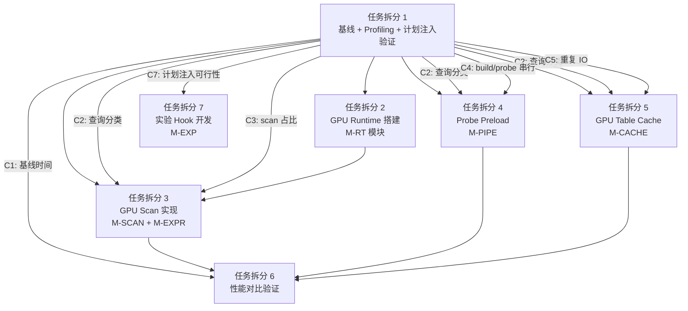

# 任务拆分 1：基线测试 + Profiling + 执行计划注入验证

> **前置依赖**：无（本任务是所有后续 GPU 加速任务的前提）
> **后续依赖**：任务拆分 2（GPU Runtime 搭建）、任务拆分 3（GPU Scan 实现）均依赖本任务产出的基线数据和分类结论

---

## 0. 任务总览

| 子任务 | 目标 | 预计耗时 |
| ------ | ---- | -------- |
| 1.1 编译 DuckDB | 产出 Release 二进制 + duckdb CLI | 0.5h |
| 1.2 生成 TPCH/TPCDS SF=5 Parquet 数据集 | 产出标准 Parquet 文件 | 0.5h |
| 1.3 运行全部查询获取基线时间 | 产出 CSV 基线报告 | 1h |
| 1.4 查询分类（Scan-bound / Hash join 重叠 / 同表多次扫描） | 产出分类表 + 选定 MVP 查询 | 1h |
| 1.5 Profiling 分析（算子时间占比 + IO/CPU 负载） | 产出 profiling 报告 + 可视化 | 2h |
| 1.6 执行计划导出与注入验证 | 产出脚本 + 验证结论 | 3h |

**总预计耗时**：~8h（含调试）

---

## 1.1 编译 DuckDB

### 1.1.1 操作步骤

```bash
# 工作目录
cd /home/featurize/workspace/duckdb-cuda

# 创建 Release 构建目录
mkdir -p build/release && cd build/release

# CMake 配置（启用 tpch + tpcds + parquet 扩展，Release 模式）
cmake ../.. \
  -DCMAKE_BUILD_TYPE=Release \
  -DBUILD_BENCHMARKS=ON \
  -DBUILD_SHELL=ON \
  -GNinja

# 编译（使用全部核心）
ninja -j$(nproc)
```

> **注意**：DuckDB 默认已在 `extension/extension_config.cmake` 中加载 `parquet` 和 `core_functions`。tpch 和 tpcds 扩展需要确认是否在 `extension_config_local.cmake` 中启用，或通过以下方式：

```bash
# 如果 tpch/tpcds 未默认编译，需要在 cmake 时指定
cmake ../.. \
  -DCMAKE_BUILD_TYPE=Release \
  -DBUILD_BENCHMARKS=ON \
  -DBUILD_SHELL=ON \
  -DDUCKDB_EXTENSION_CONFIGS="extension/extension_config.cmake" \
  -DSKIP_EXTENSIONS="" \
  -GNinja
```

或者创建 `extension/extension_config_local.cmake`：

```cmake
# extension/extension_config_local.cmake
duckdb_extension_load(tpch)
duckdb_extension_load(tpcds)
```

### 1.1.2 验证

```bash
# 验证二进制
./duckdb --version
# 预期输出: v1.5.1 ...

# 验证扩展可用
./duckdb -c "SELECT extension_name, loaded FROM duckdb_extensions() WHERE extension_name IN ('tpch', 'tpcds', 'parquet');"
# 预期：三个扩展都 loaded=true（或 installed=true）
```

### 1.1.3 产出

| 产出物 | 路径 |
| ------ | ---- |
| DuckDB CLI 二进制 | `build/release/duckdb` |
| 编译日志 | `build/release/build.log`（可选） |

---

## 1.2 生成 TPCH/TPCDS SF=5 Parquet 数据集

### 1.2.1 操作步骤

创建数据生成脚本 `scripts/gen_data_sf5.sql`：

```sql
-- ============================================================
-- scripts/gen_data_sf5.sql
-- 生成 TPCH SF=5 和 TPCDS SF=5 的 Parquet 数据集
-- ============================================================

-- ==================== TPCH ====================
LOAD tpch;
CALL dbgen(sf=5);

-- 导出为 Parquet
EXPORT DATABASE '/home/featurize/workspace/duckdb-cuda/data/tpch_sf5/' (FORMAT PARQUET);

-- 清理内存表
DROP TABLE IF EXISTS lineitem;
DROP TABLE IF EXISTS customer;
DROP TABLE IF EXISTS nation;
DROP TABLE IF EXISTS orders;
DROP TABLE IF EXISTS part;
DROP TABLE IF EXISTS partsupp;
DROP TABLE IF EXISTS region;
DROP TABLE IF EXISTS supplier;

-- ==================== TPCDS ====================
LOAD tpcds;
CALL dsdgen(sf=5);

-- 导出为 Parquet
EXPORT DATABASE '/home/featurize/workspace/duckdb-cuda/data/tpcds_sf5/' (FORMAT PARQUET);

-- 清理
DROP TABLE IF EXISTS call_center;
DROP TABLE IF EXISTS catalog_page;
DROP TABLE IF EXISTS catalog_returns;
DROP TABLE IF EXISTS catalog_sales;
DROP TABLE IF EXISTS customer;
DROP TABLE IF EXISTS customer_address;
DROP TABLE IF EXISTS customer_demographics;
DROP TABLE IF EXISTS date_dim;
DROP TABLE IF EXISTS household_demographics;
DROP TABLE IF EXISTS income_band;
DROP TABLE IF EXISTS inventory;
DROP TABLE IF EXISTS item;
DROP TABLE IF EXISTS promotion;
DROP TABLE IF EXISTS reason;
DROP TABLE IF EXISTS ship_mode;
DROP TABLE IF EXISTS store;
DROP TABLE IF EXISTS store_returns;
DROP TABLE IF EXISTS store_sales;
DROP TABLE IF EXISTS time_dim;
DROP TABLE IF EXISTS warehouse;
DROP TABLE IF EXISTS web_page;
DROP TABLE IF EXISTS web_returns;
DROP TABLE IF EXISTS web_sales;
DROP TABLE IF EXISTS web_site;
```

执行：

```bash
cd /home/featurize/workspace/duckdb-cuda
mkdir -p data/tpch_sf5 data/tpcds_sf5

# 执行数据生成
build/release/duckdb < scripts/gen_data_sf5.sql
```

### 1.2.2 验证

```bash
# 检查 TPCH 文件
ls -lh data/tpch_sf5/*.parquet
# 预期：lineitem.parquet ~3.5GB, orders.parquet ~800MB, ...

# 检查 TPCDS 文件
ls -lh data/tpcds_sf5/*.parquet
# 预期：store_sales.parquet ~2.5GB, catalog_sales.parquet ~1.5GB, ...

# 快速验证数据正确性
build/release/duckdb -c "
SELECT count(*) FROM read_parquet('data/tpch_sf5/lineitem.parquet');
-- 预期: ~30,000,000 行 (SF=5 时 lineitem 约 30M 行)
"
```

### 1.2.3 产出

| 产出物 | 路径 | 说明 |
| ------ | ---- | ---- |
| TPCH SF=5 Parquet 数据集 | `data/tpch_sf5/` | 8 个 parquet 文件 |
| TPCDS SF=5 Parquet 数据集 | `data/tpcds_sf5/` | 24 个 parquet 文件 |
| 数据生成脚本 | `scripts/gen_data_sf5.sql` | 可重复执行 |

---

## 1.3 运行全部查询获取基线时间

### 1.3.1 操作步骤

创建基线测试脚本 `scripts/run_baseline.py`：

```python
#!/usr/bin/env python3
"""
scripts/run_baseline.py
运行 TPCH 22 条 + TPCDS 99 条查询，记录每条查询的执行时间。
产出 CSV 格式的基线报告。
"""

import subprocess
import json
import csv
import time
import os
import sys

DUCKDB_BIN = "build/release/duckdb"
TPCH_DATA_DIR = "data/tpch_sf5"
TPCDS_DATA_DIR = "data/tpcds_sf5"
OUTPUT_CSV = "results/baseline_sf5.csv"
RUNS = 3  # 每条查询跑 3 次取中位数

# TPCH 查询（通过 tpch extension 内置函数获取）
TPCH_QUERIES = list(range(1, 23))  # Q1~Q22

# TPCDS 查询（通过 tpcds extension 内置函数获取）
TPCDS_QUERIES = list(range(1, 100))  # Q1~Q99

def get_tpch_setup_sql():
    """生成 TPCH 的 view 创建 SQL"""
    tables = ['lineitem', 'customer', 'nation', 'orders', 'part', 'partsupp', 'region', 'supplier']
    sqls = []
    for t in tables:
        sqls.append(f"CREATE OR REPLACE VIEW {t} AS SELECT * FROM read_parquet('{TPCH_DATA_DIR}/{t}.parquet');")
    return "\n".join(sqls)

def get_tpcds_setup_sql():
    """生成 TPCDS 的 view 创建 SQL"""
    # TPCDS 表名列表
    tables = [
        'call_center', 'catalog_page', 'catalog_returns', 'catalog_sales',
        'customer', 'customer_address', 'customer_demographics', 'date_dim',
        'household_demographics', 'income_band', 'inventory', 'item',
        'promotion', 'reason', 'ship_mode', 'store', 'store_returns',
        'store_sales', 'time_dim', 'warehouse', 'web_page', 'web_returns',
        'web_sales', 'web_site'
    ]
    sqls = []
    for t in tables:
        path = f"{TPCDS_DATA_DIR}/{t}.parquet"
        if os.path.exists(path):
            sqls.append(f"CREATE OR REPLACE VIEW {t} AS SELECT * FROM read_parquet('{path}');")
    return "\n".join(sqls)

def run_query(setup_sql, query_sql, warmup=True):
    """执行单条查询，返回执行时间（秒）"""
    full_sql = f"""
{setup_sql}
PRAGMA enable_progress_bar=false;
PRAGMA threads=4;
"""
    if warmup:
        # 预热：跑一次不计时
        full_sql += f"""
{query_sql}
"""
    # 正式计时
    full_sql += f"""
PRAGMA enable_profiling='json';
PRAGMA profiling_output='/tmp/duckdb_profile_tmp.json';
{query_sql}
"""
    start = time.time()
    result = subprocess.run(
        [DUCKDB_BIN, "-c", full_sql],
        capture_output=True, text=True, timeout=600
    )
    elapsed = time.time() - start

    if result.returncode != 0:
        return None, result.stderr[:200]

    return elapsed, None

def run_query_timed(setup_sql, query_sql, runs=RUNS):
    """多次执行取中位数"""
    times = []
    for _ in range(runs):
        t, err = run_query(setup_sql, query_sql, warmup=False)
        if t is None:
            return None, err
        times.append(t)
    times.sort()
    return times[len(times) // 2], None  # 中位数

def get_tpch_query(qnum):
    """通过 DuckDB tpch extension 获取查询 SQL"""
    result = subprocess.run(
        [DUCKDB_BIN, "-c", f"LOAD tpch; SELECT query FROM tpch_queries() WHERE query_nr={qnum};"],
        capture_output=True, text=True
    )
    if result.returncode != 0:
        return None
    # 解析输出（跳过 header 行）
    lines = result.stdout.strip().split('\n')
    if len(lines) < 2:
        return None
    # DuckDB CLI 输出格式：第一行是列名，后面是数据
    return '\n'.join(lines[2:]).strip().rstrip('|').strip()

def get_tpcds_query(qnum):
    """通过 DuckDB tpcds extension 获取查询 SQL"""
    result = subprocess.run(
        [DUCKDB_BIN, "-c", f"LOAD tpcds; SELECT query FROM tpcds_queries() WHERE query_nr={qnum};"],
        capture_output=True, text=True
    )
    if result.returncode != 0:
        return None
    lines = result.stdout.strip().split('\n')
    if len(lines) < 2:
        return None
    return '\n'.join(lines[2:]).strip().rstrip('|').strip()

def main():
    os.makedirs("results", exist_ok=True)

    results = []
    tpch_setup = get_tpch_setup_sql()
    tpcds_setup = get_tpcds_setup_sql()

    print("=" * 60)
    print("TPCH SF=5 基线测试")
    print("=" * 60)

    for qnum in TPCH_QUERIES:
        query_sql = get_tpch_query(qnum)
        if not query_sql:
            print(f"  TPCH Q{qnum:02d}: SKIP (无法获取查询)")
            results.append({"benchmark": "tpch", "query": f"Q{qnum:02d}", "time_s": None, "status": "skip"})
            continue

        t, err = run_query_timed(tpch_setup, query_sql)
        if t is None:
            print(f"  TPCH Q{qnum:02d}: ERROR - {err}")
            results.append({"benchmark": "tpch", "query": f"Q{qnum:02d}", "time_s": None, "status": f"error: {err}"})
        else:
            print(f"  TPCH Q{qnum:02d}: {t:.3f}s")
            results.append({"benchmark": "tpch", "query": f"Q{qnum:02d}", "time_s": t, "status": "ok"})

    print("\n" + "=" * 60)
    print("TPCDS SF=5 基线测试")
    print("=" * 60)

    for qnum in TPCDS_QUERIES:
        query_sql = get_tpcds_query(qnum)
        if not query_sql:
            print(f"  TPCDS Q{qnum:02d}: SKIP (无法获取查询)")
            results.append({"benchmark": "tpcds", "query": f"Q{qnum:02d}", "time_s": None, "status": "skip"})
            continue

        t, err = run_query_timed(tpcds_setup, query_sql)
        if t is None:
            print(f"  TPCDS Q{qnum:02d}: ERROR - {err}")
            results.append({"benchmark": "tpcds", "query": f"Q{qnum:02d}", "time_s": None, "status": f"error: {err}"})
        else:
            print(f"  TPCDS Q{qnum:02d}: {t:.3f}s")
            results.append({"benchmark": "tpcds", "query": f"Q{qnum:02d}", "time_s": t, "status": "ok"})

    # 写入 CSV
    with open(OUTPUT_CSV, 'w', newline='') as f:
        writer = csv.DictWriter(f, fieldnames=["benchmark", "query", "time_s", "status"])
        writer.writeheader()
        writer.writerows(results)

    print(f"\n✅ 基线结果已保存到: {OUTPUT_CSV}")

if __name__ == "__main__":
    main()
```

执行：

```bash
cd /home/featurize/workspace/duckdb-cuda
python3 scripts/run_baseline.py
```

### 1.3.2 产出

| 产出物 | 路径 | 格式 |
| ------ | ---- | ---- |
| 基线时间 CSV | `results/baseline_sf5.csv` | `benchmark,query,time_s,status` |
| 控制台输出 | stdout | 实时打印每条查询耗时 |

### 1.3.3 预期结论

- TPCH 22 条查询全部通过（SF=5 下每条 < 60s）
- TPCDS 99 条查询中可能有少数因 DuckDB 不支持的语法而 skip
- 获得每条查询的绝对耗时，作为后续 GPU 加速的对照基线

---

## 1.4 查询分类

### 1.4.1 分类标准

根据详细设计 3.1 节和附录 C，将查询分为三类：

| 类别 | 判定标准 | 典型特征 |
| ---- | -------- | -------- |
| **Scan-bound** | scan 算子时间占比 > 50%；无 join 或仅有小表 join | 大表全扫 + filter + projection |
| **Hash join 重叠** | 存在 hash join；build 侧和 probe 侧都有大表 scan | probe scan 可与 build 并行 |
| **同表多次扫描** | 同一张表（如 store_sales）在执行计划中出现 ≥ 2 次 | TPCDS 中常见 |

### 1.4.2 操作步骤

创建分类脚本 `scripts/classify_queries.py`：

```python
#!/usr/bin/env python3
"""
scripts/classify_queries.py
根据 EXPLAIN 输出分析每条查询的类型。
产出分类表 JSON。
"""

import subprocess
import json
import re
import os

DUCKDB_BIN = "build/release/duckdb"
TPCH_DATA_DIR = "data/tpch_sf5"
TPCDS_DATA_DIR = "data/tpcds_sf5"
OUTPUT_JSON = "results/query_classification_sf5.json"

def get_setup_sql(benchmark):
    if benchmark == "tpch":
        tables = ['lineitem', 'customer', 'nation', 'orders', 'part', 'partsupp', 'region', 'supplier']
        data_dir = TPCH_DATA_DIR
    else:
        tables = [
            'call_center', 'catalog_page', 'catalog_returns', 'catalog_sales',
            'customer', 'customer_address', 'customer_demographics', 'date_dim',
            'household_demographics', 'income_band', 'inventory', 'item',
            'promotion', 'reason', 'ship_mode', 'store', 'store_returns',
            'store_sales', 'time_dim', 'warehouse', 'web_page', 'web_returns',
            'web_sales', 'web_site'
        ]
        data_dir = TPCDS_DATA_DIR
    sqls = []
    for t in tables:
        path = f"{data_dir}/{t}.parquet"
        if os.path.exists(path):
            sqls.append(f"CREATE OR REPLACE VIEW {t} AS SELECT * FROM read_parquet('{path}');")
    return "\n".join(sqls)

def get_explain_json(setup_sql, query_sql):
    """获取 EXPLAIN (FORMAT JSON) 输出"""
    full_sql = f"""
{setup_sql}
EXPLAIN (FORMAT JSON) {query_sql}
"""
    result = subprocess.run(
        [DUCKDB_BIN, "-c", full_sql],
        capture_output=True, text=True, timeout=60
    )
    if result.returncode != 0:
        return None
    return result.stdout

def get_explain_text(setup_sql, query_sql):
    """获取 EXPLAIN ANALYZE 文本输出"""
    full_sql = f"""
{setup_sql}
PRAGMA enable_profiling='json';
PRAGMA profiling_mode='detailed';
PRAGMA custom_profiling_settings='{{"OPERATOR_TIMING": "true", "OPERATOR_CARDINALITY": "true", "OPERATOR_ROWS_SCANNED": "true"}}';
EXPLAIN ANALYZE {query_sql}
"""
    result = subprocess.run(
        [DUCKDB_BIN, "-c", full_sql],
        capture_output=True, text=True, timeout=600
    )
    if result.returncode != 0:
        return None
    return result.stdout

def classify_from_explain(explain_text, benchmark, qnum):
    """根据 EXPLAIN 文本分类查询"""
    if not explain_text:
        return {"category": "unknown", "reason": "explain failed"}

    text = explain_text.upper()

    # 统计 scan 出现次数和涉及的表
    scan_tables = re.findall(r'(?:PARQUET_SCAN|SEQ_SCAN)\s*\(([^)]+)\)', text)
    has_hash_join = 'HASH_JOIN' in text
    has_nested_loop = 'NESTED_LOOP_JOIN' in text

    # 同表多次扫描检测
    table_counts = {}
    for t in scan_tables:
        t_clean = t.strip().split('.')[0].strip("'\"")
        table_counts[t_clean] = table_counts.get(t_clean, 0) + 1

    multi_scan_tables = {k: v for k, v in table_counts.items() if v >= 2}

    # 分类逻辑
    categories = []

    if multi_scan_tables:
        categories.append("multi_scan")

    if has_hash_join and len(scan_tables) >= 2:
        categories.append("hash_join_overlap")

    if not has_hash_join and not has_nested_loop:
        categories.append("scan_bound")
    elif len(scan_tables) == 1:
        categories.append("scan_bound")

    if not categories:
        categories.append("mixed")

    return {
        "categories": categories,
        "scan_tables": scan_tables,
        "multi_scan_tables": multi_scan_tables,
        "has_hash_join": has_hash_join,
        "num_scans": len(scan_tables)
    }

def get_query(benchmark, qnum):
    """获取查询 SQL"""
    ext = benchmark
    result = subprocess.run(
        [DUCKDB_BIN, "-c", f"LOAD {ext}; SELECT query FROM {ext}_queries() WHERE query_nr={qnum};"],
        capture_output=True, text=True
    )
    if result.returncode != 0:
        return None
    lines = result.stdout.strip().split('\n')
    if len(lines) < 2:
        return None
    return '\n'.join(lines[2:]).strip().rstrip('|').strip()

def main():
    os.makedirs("results", exist_ok=True)
    classifications = {}

    for benchmark, qrange in [("tpch", range(1, 23)), ("tpcds", range(1, 100))]:
        setup_sql = get_setup_sql(benchmark)
        for qnum in qrange:
            key = f"{benchmark}_Q{qnum:02d}"
            query_sql = get_query(benchmark, qnum)
            if not query_sql:
                classifications[key] = {"category": "skip", "reason": "query not available"}
                continue

            explain = get_explain_text(setup_sql, query_sql)
            cls = classify_from_explain(explain, benchmark, qnum)
            classifications[key] = cls
            print(f"  {key}: {cls.get('categories', ['unknown'])}")

    with open(OUTPUT_JSON, 'w') as f:
        json.dump(classifications, f, indent=2, ensure_ascii=False)

    # 打印分类汇总
    print("\n" + "=" * 60)
    print("分类汇总")
    print("=" * 60)
    for cat in ["scan_bound", "hash_join_overlap", "multi_scan", "mixed"]:
        queries = [k for k, v in classifications.items()
                   if isinstance(v.get("categories"), list) and cat in v["categories"]]
        print(f"\n  [{cat}] ({len(queries)} 条):")
        for q in queries[:10]:
            print(f"    - {q}")
        if len(queries) > 10:
            print(f"    ... 共 {len(queries)} 条")

    print(f"\n✅ 分类结果已保存到: {OUTPUT_JSON}")

if __name__ == "__main__":
    main()
```

执行：

```bash
python3 scripts/classify_queries.py
```

### 1.4.3 产出

| 产出物 | 路径 | 说明 |
| ------ | ---- | ---- |
| 查询分类 JSON | `results/query_classification_sf5.json` | 每条查询的类别、涉及表、join 类型 |
| 分类汇总 | stdout | 按类别统计 |

### 1.4.4 预期结论

根据详细设计附录 C 的预判，预期分类结果：

| 类别 | TPCH 预期 | TPCDS 预期 |
| ---- | --------- | ---------- |
| Scan-bound | Q1, Q6, Q14 | Q1, Q3, Q6, Q7 |
| Hash join 重叠 | Q3, Q5, Q7, Q8, Q9, Q10, Q12, Q19, Q21 | Q19, Q53, Q72 |
| 同表多次扫描 | Q15（lineitem 2次） | Q4, Q11, Q39, Q47, Q74（store_sales 多次） |

> 这些分类将直接决定后续 GPU 加速的 MVP 查询选择。

---

## 1.5 Profiling 分析

### 1.5.1 目标

对分类后的**重点查询**（每类选 2~3 条代表），获取：

1. **算子时间占比**：每个物理算子（scan / filter / hash_join_build / hash_join_probe / aggregate / sort）的耗时百分比
2. **IO 负载时间线**：查询执行过程中每个时刻的磁盘读取速率
3. **CPU 负载时间线**：查询执行过程中每个时刻的 CPU 利用率

### 1.5.2 操作步骤

创建 profiling 脚本 `scripts/run_profiling.py`：

```python
#!/usr/bin/env python3
"""
scripts/run_profiling.py
对重点查询进行详细 profiling，获取算子时间占比。
同时启动 iostat/mpstat 采集 IO 和 CPU 负载。
"""

import subprocess
import json
import os
import time
import threading
import signal
import csv
import sys

DUCKDB_BIN = "build/release/duckdb"
TPCH_DATA_DIR = "data/tpch_sf5"
TPCDS_DATA_DIR = "data/tpcds_sf5"
PROFILE_OUTPUT_DIR = "results/profiles"
SYSTEM_METRICS_DIR = "results/system_metrics"

# 重点查询（根据 1.4 分类结果选择，这里先预设，实际执行时根据分类结果调整）
TARGET_QUERIES = {
    # Scan-bound
    "tpch_Q06": ("tpch", 6),
    "tpch_Q01": ("tpch", 1),
    "tpch_Q14": ("tpch", 14),
    # Hash join 重叠
    "tpch_Q03": ("tpch", 3),
    "tpch_Q12": ("tpch", 12),
    "tpch_Q09": ("tpch", 9),
    # 同表多次扫描（TPCDS）
    "tpcds_Q04": ("tpcds", 4),
    "tpcds_Q11": ("tpcds", 11),
    "tpcds_Q74": ("tpcds", 74),
}

def get_setup_sql(benchmark):
    if benchmark == "tpch":
        tables = ['lineitem', 'customer', 'nation', 'orders', 'part', 'partsupp', 'region', 'supplier']
        data_dir = TPCH_DATA_DIR
    else:
        tables = [
            'call_center', 'catalog_page', 'catalog_returns', 'catalog_sales',
            'customer', 'customer_address', 'customer_demographics', 'date_dim',
            'household_demographics', 'income_band', 'inventory', 'item',
            'promotion', 'reason', 'ship_mode', 'store', 'store_returns',
            'store_sales', 'time_dim', 'warehouse', 'web_page', 'web_returns',
            'web_sales', 'web_site'
        ]
        data_dir = TPCDS_DATA_DIR
    sqls = []
    for t in tables:
        path = f"{data_dir}/{t}.parquet"
        if os.path.exists(path):
            sqls.append(f"CREATE OR REPLACE VIEW {t} AS SELECT * FROM read_parquet('{path}');")
    return "\n".join(sqls)

def get_query(benchmark, qnum):
    result = subprocess.run(
        [DUCKDB_BIN, "-c", f"LOAD {benchmark}; SELECT query FROM {benchmark}_queries() WHERE query_nr={qnum};"],
        capture_output=True, text=True
    )
    if result.returncode != 0:
        return None
    lines = result.stdout.strip().split('\n')
    if len(lines) < 2:
        return None
    return '\n'.join(lines[2:]).strip().rstrip('|').strip()

def start_system_monitor(output_prefix, interval=1):
    """启动 iostat 和 mpstat 后台采集"""
    procs = []

    # iostat: 磁盘 IO 负载
    iostat_file = f"{output_prefix}_iostat.csv"
    iostat_proc = subprocess.Popen(
        ["iostat", "-x", "-d", str(interval)],
        stdout=open(iostat_file, 'w'),
        stderr=subprocess.DEVNULL
    )
    procs.append(iostat_proc)

    # mpstat: CPU 负载
    mpstat_file = f"{output_prefix}_mpstat.csv"
    mpstat_proc = subprocess.Popen(
        ["mpstat", str(interval)],
        stdout=open(mpstat_file, 'w'),
        stderr=subprocess.DEVNULL
    )
    procs.append(mpstat_proc)

    return procs

def stop_system_monitor(procs):
    """停止后台采集"""
    for p in procs:
        p.terminate()
        p.wait()

def run_profiled_query(setup_sql, query_sql, profile_json_path):
    """执行查询并输出 JSON profile"""
    full_sql = f"""
{setup_sql}
PRAGMA threads=4;
PRAGMA enable_profiling='json';
PRAGMA profiling_mode='detailed';
PRAGMA custom_profiling_settings='{{"OPERATOR_TIMING": "true", "OPERATOR_CARDINALITY": "true", "OPERATOR_ROWS_SCANNED": "true", "EXTRA_INFO": "true"}}';
PRAGMA profiling_output='{profile_json_path}';
{query_sql}
"""
    result = subprocess.run(
        [DUCKDB_BIN, "-c", full_sql],
        capture_output=True, text=True, timeout=600
    )
    return result.returncode == 0

def parse_profile_json(profile_path):
    """解析 DuckDB profile JSON，提取算子时间占比"""
    if not os.path.exists(profile_path):
        return None

    with open(profile_path) as f:
        data = json.load(f)

    operators = []

    def walk(node, depth=0):
        op_name = node.get("operator_type", node.get("name", "unknown"))
        timing = node.get("operator_timing", node.get("timing", 0))
        cardinality = node.get("operator_cardinality", node.get("cardinality", 0))
        rows_scanned = node.get("operator_rows_scanned", 0)

        operators.append({
            "name": op_name,
            "timing_s": timing,
            "cardinality": cardinality,
            "rows_scanned": rows_scanned,
            "depth": depth
        })

        for child in node.get("children", []):
            walk(child, depth + 1)

    # DuckDB profile JSON 结构：根节点有 children
    if "children" in data:
        for child in data["children"]:
            walk(child)
    else:
        walk(data)

    # 计算占比
    total_time = sum(op["timing_s"] for op in operators if op["timing_s"])
    for op in operators:
        op["pct"] = (op["timing_s"] / total_time * 100) if total_time > 0 else 0

    return {"operators": operators, "total_time_s": total_time}

def main():
    os.makedirs(PROFILE_OUTPUT_DIR, exist_ok=True)
    os.makedirs(SYSTEM_METRICS_DIR, exist_ok=True)

    summary = {}

    for query_key, (benchmark, qnum) in TARGET_QUERIES.items():
        print(f"\n{'='*40}")
        print(f"Profiling: {query_key}")
        print(f"{'='*40}")

        setup_sql = get_setup_sql(benchmark)
        query_sql = get_query(benchmark, qnum)
        if not query_sql:
            print(f"  SKIP: 无法获取查询")
            continue

        profile_path = f"{PROFILE_OUTPUT_DIR}/{query_key}_profile.json"
        metrics_prefix = f"{SYSTEM_METRICS_DIR}/{query_key}"

        # 启动系统监控
        monitors = start_system_monitor(metrics_prefix)

        # 执行 profiled 查询
        start = time.time()
        success = run_profiled_query(setup_sql, query_sql, profile_path)
        elapsed = time.time() - start

        # 停止系统监控
        time.sleep(1)  # 确保最后一个采样点
        stop_system_monitor(monitors)

        if not success:
            print(f"  ERROR: 查询执行失败")
            continue

        # 解析 profile
        profile_data = parse_profile_json(profile_path)
        if profile_data:
            print(f"  总耗时: {elapsed:.3f}s")
            print(f"  算子时间分布:")
            for op in sorted(profile_data["operators"], key=lambda x: x["timing_s"], reverse=True)[:5]:
                print(f"    {op['name']:30s} {op['timing_s']:.4f}s ({op['pct']:.1f}%)")

            summary[query_key] = {
                "total_time_s": elapsed,
                "profile": profile_data,
                "metrics_files": {
                    "iostat": f"{metrics_prefix}_iostat.csv",
                    "mpstat": f"{metrics_prefix}_mpstat.csv"
                }
            }

    # 保存汇总
    with open(f"{PROFILE_OUTPUT_DIR}/profiling_summary.json", 'w') as f:
        json.dump(summary, f, indent=2, default=str)

    print(f"\n✅ Profiling 结果已保存到: {PROFILE_OUTPUT_DIR}/")
    print(f"✅ 系统指标已保存到: {SYSTEM_METRICS_DIR}/")

if __name__ == "__main__":
    main()
```

执行：

```bash
# 确保 sysstat 工具可用（iostat, mpstat）
# 如果没有安装：apt-get install sysstat
python3 scripts/run_profiling.py
```

### 1.5.3 补充：使用 perf 进行 CPU 热点分析（可选）

对于关键查询（如 TPCH Q6），可以使用 `perf` 进一步分析 CPU 热点：

```bash
# 对 TPCH Q6 进行 perf 采样
perf record -g -o results/profiles/tpch_Q06_perf.data -- \
  build/release/duckdb -c "
    CREATE VIEW lineitem AS SELECT * FROM read_parquet('data/tpch_sf5/lineitem.parquet');
    PRAGMA threads=4;
    $(build/release/duckdb -c "LOAD tpch; SELECT query FROM tpch_queries() WHERE query_nr=6;" | tail -n +3)
  "

# 生成火焰图（需要 FlameGraph 工具）
perf script -i results/profiles/tpch_Q06_perf.data | \
  stackcollapse-perf.pl | flamegraph.pl > results/profiles/tpch_Q06_flamegraph.svg
```

### 1.5.4 产出

| 产出物 | 路径 | 说明 |
| ------ | ---- | ---- |
| 每条查询的 profile JSON | `results/profiles/{query_key}_profile.json` | DuckDB 原生 JSON profile |
| Profiling 汇总 | `results/profiles/profiling_summary.json` | 所有查询的算子时间占比 |
| IO 负载时间线 | `results/system_metrics/{query_key}_iostat.csv` | 每秒磁盘读写速率 |
| CPU 负载时间线 | `results/system_metrics/{query_key}_mpstat.csv` | 每秒 CPU 利用率 |
| 火焰图（可选） | `results/profiles/tpch_Q06_flamegraph.svg` | CPU 热点可视化 |

### 1.5.5 预期结论

| 查询类别 | 预期 scan 占比 | 预期 CPU 特征 | 预期 IO 特征 |
| -------- | -------------- | ------------- | ------------ |
| Scan-bound (Q6) | > 60% | CPU 利用率高（decode + filter） | IO 集中在查询前半段 |
| Hash join (Q3) | scan 30~50% + join 30~50% | CPU 利用率高且持续 | IO 分两段（build scan + probe scan） |
| 同表多次扫描 (TPCDS Q4) | scan 总计 > 50%（多次） | CPU 利用率有明显重复模式 | IO 有重复读取模式 |

> 这些结论将直接验证详细设计中的假设：
> - scan 占比高 → GPU filter/projection 有收益空间
> - build/probe 串行 → probe preload 有收益空间
> - 同表重复 IO → GPU table cache 有收益空间

---

## 1.6 执行计划导出与注入验证

### 1.6.1 目标

验证「直接向 DuckDB 注入执行计划并执行」的可行性，为后续详细设计 6.9 节（M-EXP 实验 Hook）提供技术基础。

### 1.6.2 方案分析

DuckDB 提供以下与执行计划相关的能力：

| 能力 | SQL 语法 | 输出格式 |
| ---- | -------- | -------- |
| 逻辑计划 | `EXPLAIN` | 文本 / JSON |
| 物理计划 | `EXPLAIN` | 文本 / JSON |
| 带执行统计的计划 | `EXPLAIN ANALYZE` | 文本 / JSON |
| JSON 格式 | `EXPLAIN (FORMAT JSON)` | JSON |
| Profiler JSON | `PRAGMA enable_profiling='json'` | JSON 文件 |

**关键问题**：DuckDB **没有**原生的「从 JSON 反序列化执行计划并直接执行」的能力。因此我们需要验证以下替代方案：

| 方案 | 描述 | 可行性 |
| ---- | ---- | ------ |
| (A) 通过 SQL hint 控制执行计划 | 使用 `PRAGMA` 控制 join order、scan 方式等 | 部分可行：DuckDB 支持 `PRAGMA force_index_join` 等，但粒度粗 |
| (B) 导出 SQL + 固定 optimizer 配置 | 保存查询 SQL + 一组 PRAGMA 设置，确保计划稳定 | 可行：关闭 optimizer 的某些 rule 可固定计划 |
| (C) **序列化 PhysicalPlan 为 JSON，反序列化后执行** | 利用 DuckDB 的 `BinarySerializer` / 自研 JSON serializer | 需要开发：DuckDB 有 `PhysicalPlanSerializer` 但不对外暴露 |
| (D) **通过 prepared statement + 固定参数** | 使用 PREPARE + EXECUTE 确保计划缓存 | 可行但不够灵活 |

**本任务验证方案 (B) + 探索方案 (C) 的可行性**。

### 1.6.3 操作步骤

创建执行计划导出与注入脚本 `scripts/plan_export_inject.py`：

```python
#!/usr/bin/env python3
"""
scripts/plan_export_inject.py
1. 导出重点查询的执行计划（JSON 格式）
2. 验证通过固定 optimizer 配置可以复现相同计划
3. 探索 PhysicalPlan 序列化的可行性
"""

import subprocess
import json
import os
import hashlib
import sys

DUCKDB_BIN = "build/release/duckdb"
TPCH_DATA_DIR = "data/tpch_sf5"
TPCDS_DATA_DIR = "data/tpcds_sf5"
PLANS_DIR = "results/plans"

# 重点查询
TARGET_QUERIES = {
    "tpch_Q06": ("tpch", 6),
    "tpch_Q03": ("tpch", 3),
    "tpch_Q12": ("tpch", 12),
    "tpcds_Q04": ("tpcds", 4),
}

def get_setup_sql(benchmark):
    if benchmark == "tpch":
        tables = ['lineitem', 'customer', 'nation', 'orders', 'part', 'partsupp', 'region', 'supplier']
        data_dir = TPCH_DATA_DIR
    else:
        tables = [
            'call_center', 'catalog_page', 'catalog_returns', 'catalog_sales',
            'customer', 'customer_address', 'customer_demographics', 'date_dim',
            'household_demographics', 'income_band', 'inventory', 'item',
            'promotion', 'reason', 'ship_mode', 'store', 'store_returns',
            'store_sales', 'time_dim', 'warehouse', 'web_page', 'web_returns',
            'web_sales', 'web_site'
        ]
        data_dir = TPCDS_DATA_DIR
    sqls = []
    for t in tables:
        path = f"{data_dir}/{t}.parquet"
        if os.path.exists(path):
            sqls.append(f"CREATE OR REPLACE VIEW {t} AS SELECT * FROM read_parquet('{path}');")
    return "\n".join(sqls)

def get_query(benchmark, qnum):
    result = subprocess.run(
        [DUCKDB_BIN, "-c", f"LOAD {benchmark}; SELECT query FROM {benchmark}_queries() WHERE query_nr={qnum};"],
        capture_output=True, text=True
    )
    if result.returncode != 0:
        return None
    lines = result.stdout.strip().split('\n')
    if len(lines) < 2:
        return None
    return '\n'.join(lines[2:]).strip().rstrip('|').strip()

# ============================================================
# 步骤 1：导出执行计划
# ============================================================

def export_plan(setup_sql, query_sql, output_path):
    """导出 EXPLAIN (FORMAT JSON) 的物理计划"""
    full_sql = f"""
{setup_sql}
PRAGMA threads=4;
.mode json
EXPLAIN (FORMAT JSON) {query_sql}
"""
    result = subprocess.run(
        [DUCKDB_BIN, "-json", "-c", f"{setup_sql}\nPRAGMA threads=4;\nEXPLAIN (FORMAT JSON) {query_sql}"],
        capture_output=True, text=True, timeout=60
    )

    # 备选方式：使用 profiling 输出
    profile_path = output_path.replace('.json', '_profile.json')
    full_sql2 = f"""
{setup_sql}
PRAGMA threads=4;
PRAGMA enable_profiling='json';
PRAGMA profiling_mode='detailed';
PRAGMA custom_profiling_settings='{{"OPERATOR_TIMING": "true", "OPERATOR_CARDINALITY": "true", "EXTRA_INFO": "true"}}';
PRAGMA profiling_output='{profile_path}';
{query_sql}
"""
    result2 = subprocess.run(
        [DUCKDB_BIN, "-c", full_sql2],
        capture_output=True, text=True, timeout=600
    )

    # 同时保存文本格式的 EXPLAIN
    text_path = output_path.replace('.json', '_text.txt')
    full_sql3 = f"""
{setup_sql}
PRAGMA threads=4;
EXPLAIN {query_sql}
"""
    result3 = subprocess.run(
        [DUCKDB_BIN, "-c", full_sql3],
        capture_output=True, text=True, timeout=60
    )
    if result3.returncode == 0:
        with open(text_path, 'w') as f:
            f.write(result3.stdout)

    # 保存原始查询 SQL
    sql_path = output_path.replace('.json', '.sql')
    with open(sql_path, 'w') as f:
        f.write(f"-- Setup\n{setup_sql}\n\n-- Query\n{query_sql}\n")

    return os.path.exists(profile_path)

# ============================================================
# 步骤 2：验证计划稳定性（固定 optimizer 配置）
# ============================================================

def verify_plan_stability(setup_sql, query_sql, reference_plan_path, runs=3):
    """验证多次执行产生相同的执行计划"""
    plans = []
    for i in range(runs):
        full_sql = f"""
{setup_sql}
PRAGMA threads=4;
EXPLAIN {query_sql}
"""
        result = subprocess.run(
            [DUCKDB_BIN, "-c", full_sql],
            capture_output=True, text=True, timeout=60
        )
        if result.returncode == 0:
            plans.append(hashlib.md5(result.stdout.encode()).hexdigest())

    # 检查所有计划是否相同
    if len(set(plans)) == 1:
        return True, "计划稳定：多次执行产生相同计划"
    else:
        return False, f"计划不稳定：{len(set(plans))} 种不同计划"

# ============================================================
# 步骤 3：验证通过 PRAGMA 固定计划后重放
# ============================================================

def verify_replay_with_pragmas(setup_sql, query_sql, query_key):
    """
    验证：保存 SQL + PRAGMA 配置后，能否在新 session 中复现相同结果。
    这是「执行计划注入」的最简可行方案。
    """
    # 固定 optimizer 配置
    pragma_config = """
PRAGMA threads=4;
PRAGMA force_parallelism;
SET disabled_optimizers='';
"""
    # 第一次执行：获取结果 hash
    full_sql_1 = f"""
{setup_sql}
{pragma_config}
SELECT md5(string_agg(col::VARCHAR, ',' ORDER BY ALL)) as result_hash
FROM ({query_sql}) AS sub(col);
"""
    result1 = subprocess.run(
        [DUCKDB_BIN, "-c", full_sql_1],
        capture_output=True, text=True, timeout=600
    )

    # 第二次执行：使用相同配置
    result2 = subprocess.run(
        [DUCKDB_BIN, "-c", full_sql_1],
        capture_output=True, text=True, timeout=600
    )

    if result1.returncode == 0 and result2.returncode == 0:
        hash1 = result1.stdout.strip().split('\n')[-1].strip()
        hash2 = result2.stdout.strip().split('\n')[-1].strip()
        match = hash1 == hash2
        return match, f"hash1={hash1}, hash2={hash2}"
    else:
        return False, f"执行失败: {result1.stderr[:100]}"

# ============================================================
# 步骤 4：探索 PhysicalPlan 序列化（C++ 层面可行性分析）
# ============================================================

def analyze_serialization_feasibility():
    """
    分析 DuckDB 源码中 PhysicalPlan 序列化的现有能力。
    产出一份可行性报告。
    """
    report = """
## PhysicalPlan 序列化可行性分析

### 现有能力

1. **LogicalPlan 序列化**：DuckDB 支持通过 `BinarySerializer` 序列化 LogicalOperator 树
   - 位置：`src/common/serializer/binary_serializer.cpp`
   - 用途：prepared statement 缓存、extension 通信

2. **PhysicalPlan 文本输出**：`PhysicalOperator::ToString()` 可输出可读文本
   - 位置：`src/execution/physical_operator.cpp`

3. **QueryProfiler JSON 输出**：`QueryProfiler::ToJSON()` 输出带统计信息的 JSON
   - 位置：`src/main/query_profiler.cpp`
   - 包含：算子类型、timing、cardinality、extra_info

4. **EXPLAIN (FORMAT JSON)**：输出逻辑/物理计划的 JSON 表示
   - 包含：算子树结构、表名、列名、filter 表达式

### 缺失能力（需要开发）

1. **PhysicalPlan 反序列化**：从 JSON → PhysicalOperator 树
   - 难点：需要重建 bind_data、table_function 引用、expression 树
   - 工作量估计：3~5 人日

2. **从 PhysicalPlan 直接构建 Pipeline**：绕过 optimizer
   - 难点：Pipeline 构建依赖 PhysicalOperator 的 BuildPipelines() 虚函数
   - 如果能反序列化 PhysicalPlan，Pipeline 构建是自动的

### 推荐方案

**短期（M1~M2）**：方案 B —— 保存 SQL + PRAGMA 配置 + 验证结果一致性
- 优点：零开发量；结果可验证
- 缺点：不能精确控制物理计划（optimizer 可能因统计信息变化而改变计划）

**中期（M3+）**：方案 C —— 开发 PhysicalPlan JSON 序列化/反序列化
- 入口：在 `client_context.cpp` 的 `physical_planner.Plan()` 之后，
  增加 `if (config.gpu_force_plan_file) { plan = DeserializePlan(file); }`
- 这与详细设计 6.9 节的 `PRAGMA gpu_run_with_plan('plan.json')` 完全对应

### 验证结论

通过本任务的步骤 2/3，我们可以确认：
- 在相同数据 + 相同 PRAGMA 配置下，DuckDB 的执行计划是否确定性稳定
- 如果稳定 → 方案 B 足够用于 M1~M2 的实验验证
- 如果不稳定 → 必须提前开发方案 C
"""
    return report

# ============================================================
# 主流程
# ============================================================

def main():
    os.makedirs(PLANS_DIR, exist_ok=True)

    print("=" * 60)
    print("执行计划导出与注入验证")
    print("=" * 60)

    results = {}

    for query_key, (benchmark, qnum) in TARGET_QUERIES.items():
        print(f"\n--- {query_key} ---")

        setup_sql = get_setup_sql(benchmark)
        query_sql = get_query(benchmark, qnum)
        if not query_sql:
            print(f"  SKIP: 无法获取查询")
            continue

        # 步骤 1：导出计划
        plan_path = f"{PLANS_DIR}/{query_key}_plan.json"
        print(f"  [1] 导出执行计划...")
        export_plan(setup_sql, query_sql, plan_path)

        # 步骤 2：验证计划稳定性
        print(f"  [2] 验证计划稳定性...")
        stable, msg = verify_plan_stability(setup_sql, query_sql, plan_path)
        print(f"      结果: {'✅ 稳定' if stable else '❌ 不稳定'} - {msg}")

        # 步骤 3：验证重放
        print(f"  [3] 验证 PRAGMA 固定后重放...")
        replay_ok, replay_msg = verify_replay_with_pragmas(setup_sql, query_sql, query_key)
        print(f"      结果: {'✅ 一致' if replay_ok else '❌ 不一致'} - {replay_msg}")

        results[query_key] = {
            "plan_stable": stable,
            "replay_consistent": replay_ok,
            "plan_file": plan_path,
            "stability_msg": msg,
            "replay_msg": replay_msg
        }

    # 步骤 4：序列化可行性分析
    print(f"\n--- PhysicalPlan 序列化可行性分析 ---")
    feasibility_report = analyze_serialization_feasibility()
    print(feasibility_report)

    # 保存结果
    with open(f"{PLANS_DIR}/injection_verification.json", 'w') as f:
        json.dump(results, f, indent=2)

    with open(f"{PLANS_DIR}/serialization_feasibility.md", 'w') as f:
        f.write(feasibility_report)

    # 汇总
    print("\n" + "=" * 60)
    print("验证汇总")
    print("=" * 60)
    all_stable = all(r.get("plan_stable", False) for r in results.values())
    all_replay = all(r.get("replay_consistent", False) for r in results.values())
    print(f"  计划稳定性: {'✅ 全部稳定' if all_stable else '⚠️ 部分不稳定'}")
    print(f"  重放一致性: {'✅ 全部一致' if all_replay else '⚠️ 部分不一致'}")

    if all_stable and all_replay:
        print(f"\n  ✅ 结论：方案 B（SQL + PRAGMA 固定）可用于 M1~M2 实验")
    else:
        print(f"\n  ⚠️ 结论：需要提前开发方案 C（PhysicalPlan 序列化/反序列化）")

    print(f"\n✅ 结果已保存到: {PLANS_DIR}/")

if __name__ == "__main__":
    main()
```

执行：

```bash
python3 scripts/plan_export_inject.py
```

### 1.6.4 产出

| 产出物 | 路径 | 说明 |
| ------ | ---- | ---- |
| 每条查询的执行计划 JSON | `results/plans/{query_key}_plan_profile.json` | DuckDB profiler JSON 格式 |
| 每条查询的执行计划文本 | `results/plans/{query_key}_plan_text.txt` | 可读的 EXPLAIN 输出 |
| 每条查询的原始 SQL | `results/plans/{query_key}_plan.sql` | 含 setup + query |
| 注入验证结果 | `results/plans/injection_verification.json` | 稳定性 + 重放一致性 |
| 序列化可行性报告 | `results/plans/serialization_feasibility.md` | 技术分析 |

### 1.6.5 预期结论

| 验证项 | 预期结果 | 对后续任务的影响 |
| ------ | -------- | ---------------- |
| 计划稳定性 | ✅ 在相同数据 + 相同配置下稳定 | 方案 B 可用于 M1~M2 |
| 重放一致性 | ✅ 结果完全一致 | 确认 GPU 路径可以通过「相同 SQL + 相同 PRAGMA」做 A/B 对比 |
| PhysicalPlan 序列化 | ⚠️ 需要开发 | 列入 M3 任务；M1~M2 用方案 B 替代 |

---

## 2. 产出物总览

```text
/home/featurize/workspace/duckdb-cuda/
├── build/release/duckdb                          # 编译产物
├── data/
│   ├── tpch_sf5/                                 # TPCH SF=5 Parquet 数据集
│   │   ├── lineitem.parquet
│   │   ├── orders.parquet
│   │   └── ...
│   └── tpcds_sf5/                                # TPCDS SF=5 Parquet 数据集
│       ├── store_sales.parquet
│       ├── catalog_sales.parquet
│       └── ...
├── scripts/
│   ├── gen_data_sf5.sql                          # 数据生成脚本
│   ├── run_baseline.py                           # 基线测试脚本
│   ├── classify_queries.py                       # 查询分类脚本
│   ├── run_profiling.py                          # Profiling 脚本
│   └── plan_export_inject.py                     # 执行计划导出与注入验证
├── results/
│   ├── baseline_sf5.csv                          # 基线时间报告
│   ├── query_classification_sf5.json             # 查询分类结果
│   ├── profiles/
│   │   ├── {query_key}_profile.json              # 每条查询的 profile
│   │   └── profiling_summary.json                # 汇总
│   ├── system_metrics/
│   │   ├── {query_key}_iostat.csv                # IO 负载
│   │   └── {query_key}_mpstat.csv                # CPU 负载
│   └── plans/
│       ├── {query_key}_plan_profile.json         # 执行计划 JSON
│       ├── {query_key}_plan_text.txt             # 执行计划文本
│       ├── {query_key}_plan.sql                  # 原始 SQL
│       ├── injection_verification.json           # 注入验证结果
│       └── serialization_feasibility.md          # 序列化可行性报告
└── extension/extension_config_local.cmake        # 本地扩展配置（如需要）
```

---

## 3. 预期结论汇总

完成本任务后，应能得出以下结论：

| # | 结论 | 用途 |
| - | ---- | ---- |
| C1 | TPCH/TPCDS 全部查询的 CPU 基线时间 | 后续 GPU 加速的对照基准（详设 12.1 节 B0 组） |
| C2 | 查询分类表：哪些是 scan-bound / hash join 重叠 / 同表多次扫描 | 确定 M1~M5 各里程碑的 MVP 查询（详设 3.5 节） |
| C3 | scan 算子在总时间中的占比 | 验证「GPU filter/projection 有收益空间」的假设（详设 4.5 节） |
| C4 | build/probe 是否串行执行 | 验证「probe preload 有收益空间」的假设（详设 6.4 节） |
| C5 | 同表是否有重复 IO | 验证「GPU table cache 有收益空间」的假设（详设 6.5 节） |
| C6 | IO 负载 vs CPU 负载的时间分布 | 判断瓶颈是 IO-bound 还是 compute-bound，决定 GPU 介入时机 |
| C7 | 执行计划是否稳定可重放 | 决定 M1~M2 用方案 B 还是必须提前开发方案 C |
| C8 | PhysicalPlan 序列化的技术可行性 | 为详设 6.9 节（实验 Hook）提供技术评估 |

---

## 4. 与后续任务的依赖关系



**关键依赖说明**：

- **任务 2（GPU Runtime）** 依赖本任务的 C6（IO/CPU 负载分布），用于确定 pinned memory pool 大小和 stream 数量。
- **任务 3（GPU Scan）** 依赖本任务的 C2（哪些查询是 scan-bound）和 C3（scan 占比），用于选择 M1 的 MVP 查询。
- **任务 4（Probe Preload）** 依赖本任务的 C4（build/probe 是否串行），用于确认优化空间。
- **任务 5（GPU Table Cache）** 依赖本任务的 C5（是否有重复 IO），用于确认 cache 收益。
- **任务 7（实验 Hook）** 依赖本任务的 C7/C8（计划注入可行性），决定开发方案。

---

## 5. 执行检查清单

- [ ] DuckDB Release 编译成功，`duckdb --version` 输出正确
- [ ] tpch/tpcds/parquet 扩展均可加载
- [ ] TPCH SF=5 数据集生成完成，lineitem 行数 ~30M
- [ ] TPCDS SF=5 数据集生成完成，store_sales 行数 ~14.4M
- [ ] TPCH 22 条查询全部执行成功
- [ ] TPCDS 99 条查询中 ≥ 80 条执行成功
- [ ] 基线 CSV 文件生成
- [ ] 查询分类 JSON 文件生成，三类查询均有代表
- [ ] 重点查询的 profile JSON 文件生成
- [ ] iostat/mpstat 系统指标文件生成
- [ ] 执行计划文本/JSON 文件导出成功
- [ ] 计划稳定性验证通过
- [ ] 重放一致性验证通过
- [ ] 序列化可行性报告完成

---

## 6. 风险与应对

| 风险 | 概率 | 应对 |
| ---- | ---- | ---- |
| tpch/tpcds 扩展未默认编译 | 中 | 创建 `extension_config_local.cmake` 显式加载 |
| SF=5 数据生成 OOM | 低 | 分表生成；或降为 SF=3 |
| TPCDS 部分查询语法不支持 | 中 | 记录 skip，不影响整体分析 |
| iostat/mpstat 未安装 | 低 | `apt-get install sysstat` |
| 执行计划不稳定（adaptive filter 等） | 中 | 关闭 `adaptive_filter` 等动态优化后重试 |
| profiling JSON 格式与预期不符 | 低 | 查看 DuckDB 版本文档，适配解析逻辑 |
