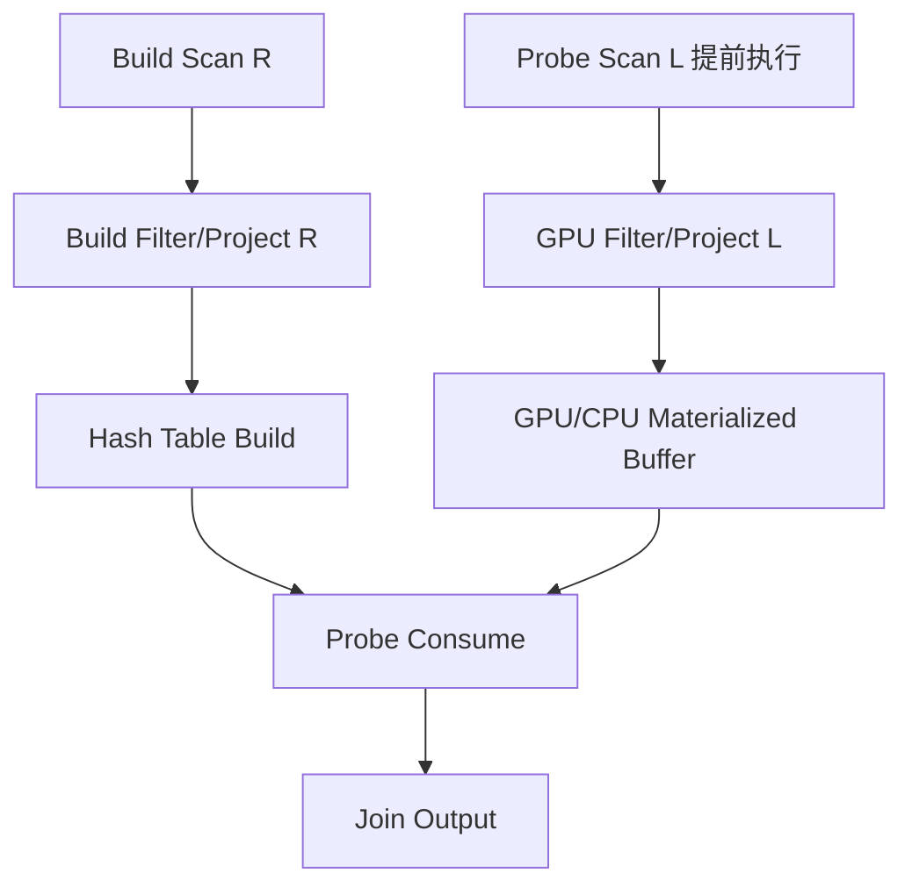

# DuckDB GPU 加速 TPCH Parquet 查询初步设计（细化版）

## 1. 背景与目标

### 1.1 项目背景

本项目探索在尽量保持 DuckDB 原有系统架构稳定的前提下，将 GPU 引入 DuckDB 的查询执行链路，用于加速以 TPCH Parquet 查询为代表的分析型负载。

DuckDB 当前执行模型具有以下特点：

- Parquet 外部表扫描通过 `parquet_scan` table function 完成，执行阶段由 `PhysicalTableScan` 拉取 `DataChunk`。
- Pipeline 执行模型以 source/operator/sink 组织，scan 通常作为 pipeline source。
- Hash Join、Aggregate、Sort 等算子会形成 pipeline 边界，其中 Hash Join build 侧通常需要先完成 hash table 构建，probe 侧 pipeline 才能继续推进。
- Parquet scan 按 row group 与 `STANDARD_VECTOR_SIZE` 粒度流式产生 `DataChunk`，不会天然把整张 Parquet 表缓存到内存。
- DuckDB 已经支持 filter pushdown、row group pruning、column pruning、late materialization 等 scan 层优化。

因此，本项目不尝试重写 DuckDB 为 GPU 原生数据库，而是将 GPU 作为：

1. **异构协处理器**：承担适合 GPU 的 scan 后处理、解压、filter、projection 等批处理任务。
2. **异构数据放置空间**：在查询执行期间或跨 pipeline 阶段缓存热点表/热点列，减少重复 SSD -> CPU 内存读取。
3. **执行重叠资源**：利用 GPU 计算与 CPU 侧 hash table build、SSD -> CPU IO、CPU pipeline 调度之间的并行性，隐藏部分数据搬运与计算开销。

### 1.2 总体目标

项目初期目标：

- 面向 TPCH 22 条 Parquet 查询，找到 GPU 加速 scan 与 scan 后轻量计算的真实收益边界。
- 选择一个典型查询作为 MVP，在不大规模改造 optimizer 的情况下完成端到端性能验证。
- 建立查询计划物化、手动改写、执行注入、性能对比的实验框架。
- 在验证有效后，再逐步将规则沉淀到 optimizer 与 scheduler 中。

最终目标：

- 在 DuckDB 原始 parser、optimizer、pipeline 和 scheduler 主框架不变的前提下，引入 GPU 感知的数据放置和执行策略。
- 对 Parquet scan 密集型查询、重复扫描同表的查询、以及可与 build 侧 pipeline 重叠的 probe 侧 scan 取得可观加速。
- 为后续扩展到 GPU hash join、group by、sort、GDS 直读等能力预留接口。

### 1.3 非目标

初期阶段明确不做以下事情：

- 不重写 DuckDB 的整体执行引擎。
- 不替换 DuckDB 的 SQL parser、binder、optimizer 主框架。
- 不在初期实现完整 GPU 版 hash join/group by/sort。
- 不假设所有查询都适合 GPU，也不追求对所有 TPCH 查询均加速。
- 不破坏 DuckDB 原有 table function、pipeline、`DataChunk` 语义。

## 2. 现有 DuckDB 执行链路分析

### 2.1 Scan 调用链

DuckDB 执行时，pipeline 从 source 拉取数据。Parquet 查询的核心链路可抽象为：

```text
PipelineExecutor::Execute
  -> PipelineExecutor::FetchFromSource
    -> PipelineExecutor::GetData
      -> pipeline.source->GetData(...)
        -> PhysicalTableScan::GetDataInternal
          -> TableFunction.function(...)
            -> parquet_scan / ParquetReader::Scan
              -> DataChunk
```

关键含义：

- `PhysicalTableScan` 是通用 scan 物理算子，不直接关心底层是否为 Parquet。
- Parquet 的实际读取逻辑在 `parquet_scan` table function 与 `ParquetReader` 内部。
- 因此，GPU 接入点可以选择在 table function 层、Parquet reader 层、或 `PhysicalTableScan` 外围包装层。

### 2.2 Parquet scan 粒度

当前 Parquet scan 具有以下粒度特征：

- 任务分配通常按 row group。
- 单次输出为一个 `DataChunk`。
- 每个 `DataChunk` 最大行数受 `STANDARD_VECTOR_SIZE` 限制。
- 有 filter 时，先读过滤列生成 `SelectionVector`，再按 selection 读取其余列。
- 支持 row group statistics 与 bloom filter 裁剪。

这意味着：

- 初期 GPU 方案不应设计为一次性全表读取后再返回结果，否则会偏离 DuckDB 的流式执行模型。
- 更合理的方式是保持 `DataChunk` 对外语义不变，在内部增加更大的 GPU batch/window，以摊薄 PCIe 传输和 kernel launch 开销。

在详细设计中：你需要给出非常具体的方案，包括一下几个点的思考和权衡
1.是新增parquet_gpu_scan这个算子，还是在parquet_scan中通过if_else来分支
2.你需要思考怎么去设计GPU batch/window，或者将数据传输到gpu上是否需要按照datachunk语义？（2048太小）。gpu仅作为协处理器，cpu不需要理解也不需要知道gpu是怎么传输和计算的，所以既要gpu上的传输计算重叠也需要尽可能发挥gpu的并行能力。最终cpu感知的datachunk语意仅仅是gpu将数据返回给cpu时才需要保持。
3.你要确定通过什么技术来实现流式传输、cpugpu数据格式转换零拷贝、传输计算重叠。

### 2.3 Pipeline 依赖与潜在重叠空间

DuckDB pipeline 中，Hash Join 常见执行方式为：

```text
右表 / build side scan + filter + projection
  -> Hash Join sink 构建 hash table
  -> build pipeline finalize
  -> 左表 / probe side scan + filter + projection
  -> Hash Join probe
```

当前依赖关系保证了 join 语义正确，但也导致 probe 侧 scan 在 build 完成前无法正常向 join 算子输出。

本项目关注的机会点是：

- probe 侧原始表 scan、解压、filter、projection 中的部分工作并不一定依赖 build 侧 hash table。
- 如果将 probe 侧前置 scan 结果放到 CPU 内存或 GPU 显存中，可以和 build 侧 hash table 构建重叠。
- build 完成后，probe 阶段可以直接消费预处理后的数据，缩短关键路径。
- 某个表被传输存储在gpu上后，如果后续存在非probe侧需要扫描该表，也可通过gpu路径进行加速。

需要注意：

- 不是所有 probe 侧表达式都可以提前执行。
- 如果 filter 条件依赖 join build 结果或 correlated 信息，则不能提前。
- 预取/预处理可能增加内存或显存占用，必须受 cost model 和资源预算控制。

## 3. 核心设计原则

### 3.1 最小侵入原则

初期尽量不改变 DuckDB 原有架构边界：

- cpu侧的处理单位完全保持 `DataChunk`语义。
- 保持 pipeline source/operator/sink 模型不变。
- 保持 CPU 原始路径作为 fallback。
- GPU 逻辑通过可开关配置启用。

### 3.2 渐进验证原则

实现顺序应从可控实验开始，而不是直接改 optimizer：

1. 先选择单个典型查询，多hashjoin，存在重复的table scan。
2. 物化原始物理计划或 pipeline 结构。
3. 手动改写为 GPU 感知执行计划。
4. 注入执行并对比性能。
5. 验证收益后再进行端到端的代码改造。

### 3.3 可回退原则

任意 GPU 阶段失败或不满足条件时，必须能回退到原始 DuckDB 路径：

- GPU 初始化失败，回退 CPU。
- 显存不足，回退 CPU 或只做 streaming GPU。
- 不支持的数据类型/压缩格式，回退 CPU。
- 查询包含不安全提前执行表达式，回退原 pipeline。

### 3.4 成本模型

在对查询优化器改造时，需要优化原本的成本模型。GPU 不是默认加速路径。是否使用 GPU 需要考虑：

- 表大小、列宽、行数、选择率。
- Parquet 压缩格式与解压成本。
- row group pruning 后实际读取量。
- CPU scan 是否已经 IO-bound。
- PCIe 传输时间与 GPU kernel 时间。
- GPU 显存容量与并发查询压力。
- 重复扫描同表或同列的次数。


## 4. 总体架构设计

### 4.1 架构分层

```text
SQL / TPCH Query
      |
      v
DuckDB Parser / Binder / Optimizer
      |
      v
Physical Plan
      |
      +-----------------------------+
      | GPU Plan Rewriter / Annotator|
      +-----------------------------+
      |
      v
Pipeline Builder / Scheduler
      |
      +-----------------------------+
      | GPU-aware Pipeline Extension |
      +-----------------------------+
      |
      v
PhysicalTableScan / parquet_scan
      |
      +-----------------------------+
      | GPU Scan Runtime            |
      | - CPU reader fallback       |
      | - pinned memory buffer      |
      | - device buffer manager     |
      | - async transfer            |
      | - GPU filter/projection     |
      +-----------------------------+
      |
      v
DataChunk / CPU Operators / Result
```

### 4.2 主要模块

#### 4.2.1 GPU 配置模块

负责控制是否启用 GPU 功能。

建议配置项：

```text
enable_gpu_acceleration = false
gpu_scan_mode = off | transfer_only | filter_project | full_experimental
gpu_memory_limit = <bytes>
gpu_min_scan_bytes = <bytes>
gpu_enable_prefetch_probe = true | false
gpu_enable_table_cache = true | false
gpu_force_query = <query_id / pattern>
gpu_debug_verify = true | false
```

#### 4.2.2 GPU 计划标注模块

输入 DuckDB physical plan，输出带 GPU annotation 的 plan。

初期可以不接入 optimizer，而使用实验脚本完成：

- 固定只测某个 TPCH（或TPCDS） query。
- 找到查询计划节点 `PhysicalTableScan`。
- 新增查询计划节点配置项，包括：
- 标注是否 GPU scan。
- 标注是否提前预取。
- 标注是否缓存表/列到 GPU。

后期再接入 cost model 与 optimizer rule。

#### 4.2.3 GPU Scan Runtime

负责 GPU scan 生命周期管理：

- 从 Parquet reader 或 CPU scan 获取输入 batch。
- 管理 pinned host memory。
- 管理 device buffer。
- 发起异步 H2D/D2H 传输。
- 执行 GPU filter/projection/decompression kernel 或调用第三方库。
- 将结果转换回 DuckDB `DataChunk`。
- 收集 profile 指标。

#### 4.2.4 GPU Table Cache

用于缓存热点表或热点列。

建议以列为单位缓存，而不是整表强制缓存：

```text
GpuTableCacheKey:
  - database / catalog / schema / table 或 parquet file path
  - row group id
  - column id list
  - filter/projection signature 可选
  - file modification time / metadata version
```

缓存内容：

- 原始列数据。
- 解压后的列数据。
- filter 后的 selection vector。
- projection 后的中间列。

初期只做查询内缓存，不做跨 query 缓存；后期再考虑生命周期、失效和并发。

#### 4.2.5 GPU Profile 与校验模块

必须具备细粒度 profile：

- Parquet read 时间。
- CPU decode/decompress 时间。
- H2D 传输时间。
- GPU kernel 时间。
- D2H 传输时间。
- CPU DataChunk materialize 时间。
- pipeline 等待时间。
- build/probe 重叠比例。
- GPU 显存峰值。

同时支持 debug verify：

- GPU 路径与 CPU 路径结果逐 chunk 对比。
- 对聚合结果做全量对比。
- 对浮点误差设置容忍阈值。

## 5. GPU Scan 方案设计
对于GPU Scan方案，采用A——B——C的步骤进行设计和开发，使得每个步骤都能进行详细的设计，并得到可展示的结果。

### 5.1 方案 A：CPU Parquet 读取 + GPU filter/projection

这是最小可行方案。

流程：

```text
ParquetReader::Scan 读取 DataChunk
      |
      v
DataChunk 拷贝到 pinned host buffer
      |
      v
异步 H2D 到 GPU
      |
      v
GPU 执行 filter / projection
      |
      v
必要列 D2H 回 CPU
      |
      v
重新形成 DataChunk 输出给原 pipeline
```

优点：

- 对 DuckDB Parquet reader 改动小。
- 不需要初期实现 GPU 解压。
- 容易验证 correctness。

缺点：

- CPU 仍承担 Parquet 解压与 decode。
- 如果 filter/projection 很轻，PCIe 开销可能超过收益。
- 需要较大 batch 才能摊薄 kernel launch 和 transfer 开销。

重点：
本方案性能一定会比duckdb原生查询更差，本方案重点在于完成“pinned memory+gpu传输“ 模块的设计和优化，以供后续步骤使用 

适用场景：

- filter/projection 表达式较复杂。
- scan 后数据量明显下降。
- CPU compute 占比高于 IO 占比。

### 5.2 方案 B：CPU 读取压缩页 + GPU 解压 + filter/projection

中期目标。

流程：

```text
读取 Parquet metadata / row group / page header
      |
      v
读取压缩 page 到 pinned host buffer
      |
      v
H2D 压缩数据
      |
      v
GPU 解压 / decode / filter / projection
      |
      v
D2H 结果 DataChunk 或保留 GPU cache
```

优点：

- 减少 CPU 解压开销。
- 更符合 GPU 批处理优势。
- 与后续 GDS 直读兼容。

难点：

- Parquet encoding 类型复杂。
- 字符串、字典编码、嵌套类型处理复杂。
- 需要谨慎处理 DuckDB logical type 与 validity mask。

重点：
本方案的传输部分代码可完全复用方案A，对于GPU解压部分可以参考cudf、apache arrow的parquet scan源代码，将其提取出来集成到本项目中，并最终兼容datachunk

初期建议限制支持范围：

- TPCH 常用基础类型。
- SNAPPY/ZSTD 中优先选择现有 GPU 库支持较好的格式。
- 先不支持复杂嵌套类型。
- 先不支持所有 Parquet encoding。

### 5.3 方案 C：GPU 常驻缓存 + CPU DataChunk 适配

面向重复扫描收益。

典型场景：

- 同一个 TPCH 查询中多次扫描同一张表。
- 不同 pipeline 中重复使用同一列集合。
- 左表 probe 侧可提前全量传输到 GPU，等待 build 侧完成后直接消费。

流程：

```text
第一次扫描表/列
      |
      +--> 正常输出 DataChunk 给当前 pipeline
      |
      +--> 同步/异步写入 GPU Table Cache

后续扫描同一表/列
      |
      +--> 命中 GPU Table Cache
      |
      +--> GPU 侧 filter/project
      |
      +--> 只返回必要结果到 CPU
```

关键问题：

- 缓存粒度：建议 row group + column 粒度。
- 缓存格式：优先解压后的列式格式。
- 失效策略：初期查询内有效，查询结束释放。
- 资源控制：显存不足时按 LRU 或成本收益释放。

## 6. Pipeline 改造方案

### 6.1 原始依赖问题

以 Hash Join 为例，原始执行中 probe 侧 pipeline 依赖 build 侧 pipeline 完成。

```text
Build Pipeline:
  scan(R) -> filter(R) -> projection(R) -> hash_table_build

Probe Pipeline:
  scan(L) -> filter(L) -> projection(L) -> hash_join_probe
```

依赖关系：

```text
Probe Pipeline depends on Build Pipeline
```

因此，`scan(L)` 在原始执行中也被动等待 build 完成。

### 6.2 拆分 Probe 侧可提前阶段

将 probe 侧 pipeline 拆成两个逻辑阶段：

```text
Probe Preload Pipeline:
  scan(L) -> early_filter(L) -> early_projection(L) -> gpu/cpu materialize

Probe Consume Pipeline:
  read_preloaded(L) -> hash_join_probe
```

依赖关系变为：

```text
Probe Preload Pipeline 与 Build Pipeline 可并行
Probe Consume Pipeline depends on Build Pipeline and Probe Preload Pipeline
```

示意图：



### 6.3 正确性约束

只有满足以下条件的 probe 侧操作才能提前：

- 表 scan 本身不依赖 build 侧结果。
- filter 表达式只引用 probe 侧列和常量。
- projection 表达式只引用 probe 侧列和确定性函数。
- 不提前执行可能产生不同副作用或非确定性的函数。
- 不改变输出行顺序要求；若上层对顺序敏感，需要保留 batch index 或禁用该优化。
- 不改变 NULL 语义、selection vector 语义和类型转换语义。

### 6.4 实现方式选择

#### 方式一：实验期手动计划改写

初期优先采用：

- 物化原始 query plan。
- 手动定位目标 scan 节点。
- 手动构造 `PreloadScan` 和 `PreloadedDataScan`。
- 通过实验入口绕开完整 optimizer。

优点：

- 快速验证收益。
- 避免早期改 optimizer 带来复杂风险。

#### 方式二：新增物理算子

可新增两个实验算子：

```text
PhysicalGpuPreloadScan
PhysicalGpuBufferScan
```

其中：

- `PhysicalGpuPreloadScan` 负责提前扫描并写入 GPU/CPU buffer。
- `PhysicalGpuBufferScan` 作为后续 pipeline source，从预加载 buffer 读取数据。

对外仍产出 `DataChunk`。

#### 方式三：PipelineBuildState 中增加 GPU preload dependency

后期在 pipeline 构建阶段自动识别：

- 哪些 scan 可提前。
- 哪些 pipeline 可并行。
- 哪些 consume pipeline 依赖 preload pipeline 和 build pipeline。

该阶段需要谨慎修改 `Pipeline` 的 `dependencies` 与 `parents`。

## 7. 查询计划物化与注入框架

### 7.1 目标

为了快速验证，需构建实验工具链：

1. 给定 SQL，输出 logical plan、physical plan、pipeline DAG。
2. 将 plan 序列化为可读格式。
3. 支持对特定 scan 节点打标。
4. 支持将改写后的 plan 注入执行。
5. 对比原始计划与 GPU 计划结果和性能。

### 7.2 计划物化内容

建议记录：

- SQL 文本。
- physical operator tree。
- 每个 scan 的表名、文件路径、列集合、filter 集合、estimated cardinality。
- pipeline 列表。
- pipeline source/operator/sink。
- pipeline dependencies。
- 每个 pipeline 的 estimated cardinality 和 profile 信息。

### 7.3 注入方式

初期可选择侵入较小的实验入口：

```text
SQL -> 原始 physical plan
        |
        v
实验 rewriter 修改目标 scan / pipeline
        |
        v
Executor 执行改写后的 physical plan
```

或者：

```text
加载 serialized plan
        |
        v
构造 physical operator tree
        |
        v
直接进入 pipeline build / executor
```

第一种方式更适合初期，避免完整实现 plan 反序列化。

## 8. MVP 查询选择

注意：这里只考察了tpc-h，没有设计tpc-ds的查询，你需要再调研一下tpc-ds的mvp

### 8.1 选择标准

优先选择满足以下条件的 TPCH 查询：

- Parquet scan 占比较高。
- 存在 Hash Join build/probe 依赖。
- probe 侧大表 scan 可提前。
- probe 侧 filter/projection 可独立执行。
- 输出结果易校验。
- 查询结构不过于复杂，便于手动计划改写。

### 8.2 候选查询方向

建议重点考察：

- `Q3`：典型 join + filter + aggregation，涉及 `lineitem` 大表。
- `Q5`：多表 join，适合分析 pipeline 依赖，但初期复杂度较高。
- `Q6`：scan/filter/aggregate 简单，适合验证 GPU scan/filter，但缺少 join 重叠空间。
- `Q12`：`lineitem` + `orders`，过滤条件相对明确。
- `Q19`：大表 filter 条件较复杂，适合验证 GPU filter 表达式收益。

初期推荐两步走：

1. **先用 Q6 验证 GPU scan/filter 的单算子收益**。
2. **再用 Q3 或 Q12 验证 probe 侧 preload 与 build 侧重叠收益**。

## 9. 性能模型

### 9.1 基础成本拆分

原始 CPU 路径成本：

```text
T_cpu = T_ssd_to_cpu + T_parquet_decode_cpu + T_filter_cpu + T_projection_cpu + T_downstream
```

GPU streaming 路径成本：

```text
T_gpu_stream = T_ssd_to_cpu + T_cpu_prepare + T_h2d + T_kernel + T_d2h + T_materialize + T_downstream
```

GPU preload 重叠路径关键路径：

```text
T_total = max(T_build_pipeline, T_probe_preload) + T_probe_consume
```

收益条件：

```text
max(T_build_pipeline, T_probe_preload) + T_probe_consume
  <
T_build_pipeline + T_probe_original
```

### 9.2 使用 GPU 的启发式条件

初期可使用规则而非完整 cost model：

- scan 输入字节数大于阈值，例如 64MB 或 256MB。
- row group pruning 后仍有足够数据量。
- filter/projection 表达式可 GPU 支持。
- 输出选择率较低，D2H 数据量明显小于 H2D 输入量。
- 同一表/列在查询中出现多次扫描。
- build pipeline 时间足够长，可以覆盖 probe preload 时间。

### 9.3 禁用 GPU 的条件

- 小表、小 row group、小结果，GPU launch 和 transfer 不划算。
- scan 已经完全 IO-bound，CPU compute 不在关键路径。
- 数据类型暂不支持。
- filter 中存在复杂 UDF、非确定性函数或不支持表达式。
- 显存不足且无法分批。
- 查询并发导致 GPU 排队时间过长。

## 10. 数据放置设计

### 10.1 Host Memory

建议使用 pinned memory 作为 CPU-GPU 传输缓冲区：

- 减少 pageable memory 拷贝开销。
- 支持异步 H2D/D2H。
- 便于与 CUDA stream 重叠。

需要控制 pinned memory 总量，避免影响系统内存管理。

### 10.2 GPU Memory

GPU memory 分为三类：

1. **Transient Buffer**：单个 batch 临时使用。
2. **Pipeline Buffer**：preload pipeline 与 consume pipeline 之间共享。
3. **Query Cache**：查询内复用的 row group/column 缓存。

显存管理策略：

- 按 query 建立 memory quota。
- 按 row group/column 粒度申请。
- 支持 spill/fallback 到 CPU buffer。
- 查询结束释放全部查询内缓存。

### 10.3 数据格式

GPU 内部建议使用列式格式：

```text
GpuColumnVector:
  - type id
  - row count
  - data buffer
  - validity mask
  - optional dictionary
  - optional offsets for string
```

CPU 侧输出仍转换为 DuckDB `Vector` / `DataChunk`。

## 11. 正确性设计

### 11.1 语义一致性

必须保持：

- SQL 三值逻辑。
- NULL 传播规则。
- DuckDB 类型转换规则。
- 字符串比较语义。
- Decimal 精度和溢出行为。
- Date/Timestamp 语义。
- SelectionVector 行过滤语义。

### 11.2 结果校验

实验阶段强制提供：

- 原始 CPU 计划结果。
- GPU 改写计划结果。
- 逐行或 hash 校验。
- 聚合查询可比较最终结果。
- 对浮点结果设置可配置 epsilon。

### 11.3 Fallback 校验

每个 GPU 节点都应有 fallback：

```text
if GPU unsupported or error:
    execute original CPU scan/operator
```

debug 模式下可同时执行 CPU/GPU 双路径，对比结果后只返回一份结果。

## 12. 工程实现计划

### 12.1 阶段一：调研与基线

目标：建立可重复性能基线。

工作项：

- 准备 TPCH Parquet 数据集，多 scale factor。
- 跑通 22 条查询。
- 收集 DuckDB profiling。
- 使用 perf 或系统工具拆分 scan、decode、filter、join、aggregate 占比。
- 输出 pipeline DAG 与耗时。
- 选择 MVP 查询。

产出：

- 查询级 profile 表。
- scan 占比分析。
- pipeline 依赖图。
- MVP 查询选择报告。

### 12.2 阶段二：计划物化与手动改写

目标：实现快速实验闭环。

工作项：

- 增加 physical plan / pipeline dump。
- 对目标 scan 节点增加实验 annotation。
- 支持手动启用 GPU scan。
- 支持手动启用 probe preload。
- 保持原始 CPU 路径可切换。

产出：

- `duckdb_gpu_experiment` 运行入口。
- 原始计划与改写计划对比。
- 可复现 benchmark 脚本。

### 12.3 阶段三：GPU scan/filter MVP

目标：完成单 scan GPU filter/projection 验证。

工作项：

- 实现 GPU runtime 初始化。
- 实现 pinned host buffer。
- 实现 device buffer。
- 实现基础类型 H2D/D2H。
- 支持 TPCH 常用谓词：比较、范围、AND/OR。
- 支持简单 projection。
- 输出 `DataChunk`。
- 增加 CPU/GPU 结果校验。

产出：

- Q6 或等价 scan-heavy 查询加速结果。
- batch size、selectivity、数据规模敏感性分析。

### 12.4 阶段四：Probe preload 与 pipeline 重叠

目标：验证 Hash Join build/probe 重叠收益。

工作项：

- 实现 `PhysicalGpuPreloadScan`。
- 实现 `PhysicalGpuBufferScan`。
- 构造 preload pipeline。
- 调整 consume pipeline 依赖。
- 记录 build 与 preload 重叠时间。
- 对 Q3/Q12 做端到端验证。

产出：

- 重叠前后 query latency 对比。
- pipeline 等待时间变化。
- CPU/GPU 利用率图。

### 12.5 阶段五：GPU Table Cache

目标：验证同表重复扫描收益。

工作项：

- 实现查询内 GPU table/column cache。
- 以 row group + column 为粒度缓存。
- 增加 cache lookup 与 fallback。
- 增加显存 quota 与 LRU。
- 选择重复扫描明显的查询验证。

产出：

- cache hit/miss profile。
- 重复 scan 查询加速比。

### 12.6 阶段六：Optimizer/Scheduler 规则化

目标：从手动实验进入自动优化。

工作项：

- 增加 GPU cost model。
- 在 optimizer 或 physical plan rewrite 阶段自动标注 GPU scan。
- 在 pipeline build 阶段自动拆分可 preload 阶段。
- 增加配置项和 explain 输出。
- 完成更多 TPCH 查询覆盖。

产出：

- 自动 GPU plan rewrite。
- `EXPLAIN` 中展示 GPU annotation。
- TPCH 22 条查询收益/退化矩阵。

## 13. Benchmark 设计

### 13.1 数据集

建议至少覆盖：

- TPCH SF1：快速功能验证。
- TPCH SF10：初步性能验证。
- TPCH SF100：验证大数据量收益和显存压力。

Parquet 参数维度：

- row group size：默认值、较小值、较大值。
- compression：SNAPPY、ZSTD、uncompressed。
- statistics：开启/关闭或构造 stats 不充分场景。

### 13.2 对比组

必须包含：

1. DuckDB 原始 CPU 路径。
2. GPU scan/filter 路径。
3. GPU preload 路径。
4. GPU cache 路径。
5. fallback 路径。

### 13.3 指标

查询级：

- end-to-end latency。
- throughput。
- 加速比。
- 结果一致性。

算子级：

- scan 时间。
- Parquet decode/decompress 时间。
- filter/projection 时间。
- join build 时间。
- join probe 时间。
- aggregate 时间。

系统级：

- SSD 读带宽。
- CPU 利用率。
- GPU SM 利用率。
- GPU memory bandwidth。
- PCIe H2D/D2H 带宽。
- 显存峰值。
- pinned memory 峰值。

重叠指标：

- build pipeline 时间。
- preload pipeline 时间。
- consume pipeline 时间。
- pipeline blocked/wait 时间。
- 实际 overlap ratio。

## 14. 风险与应对

### 14.1 PCIe 开销抵消 GPU 收益

风险：filter/projection 计算太轻，传输成本更高。

应对：

- 设置最小 scan bytes 阈值。
- 尽量在 GPU 上完成更多连续操作。
- 对高选择率场景避免 D2H 全量数据。
- 使用 pinned memory 和异步 stream。

### 14.2 Scan 实际是 IO-bound

风险：SSD -> CPU IO 是瓶颈，GPU 无法降低关键路径。

应对：

- 优先选择 CPU compute 或 pipeline wait 占比较高的查询。
- 使用 preload 与 build 侧重叠隐藏 scan 时间。
- 后期引入 GDS 直读 SSD -> GPU。

### 14.3 Parquet 格式复杂

风险：完整支持 Parquet encoding 成本高。

应对：

- 初期先做 CPU decode + GPU filter/project。
- GPU 解压阶段限制 TPCH 常用类型和编码。
- 不支持类型自动 fallback。

### 14.4 Pipeline 改造破坏语义

风险：提前执行改变顺序、NULL、非确定性函数或依赖关系。

应对：

- 初期手动白名单。
- 只提前 scan、确定性 filter、确定性 projection。
- debug 模式双路径校验。
- 保留 batch index 或禁止 order-sensitive 场景。

### 14.5 显存不足

风险：大表 preload 或 cache 导致 OOM。

应对：

- query-level memory quota。
- row group 分批。
- LRU evict。
- fallback 到 CPU buffer 或原始 scan。

### 14.6 并发查询下 GPU 争用

风险：单查询收益被 GPU 排队抵消。

应对：

- 初期只支持单 query 实验。
- 后期加入 GPU task queue。
- cost model 纳入 GPU queue time。

## 15. 代码改动范围建议

### 15.1 初期最小改动范围

建议优先集中在以下区域：

- `src/parallel/`：pipeline dump、实验依赖调整。
- `src/execution/operator/scan/`：新增或包装 GPU scan 物理算子。
- `extension/parquet/`：Parquet scan 实验 hook。
- `src/include/duckdb/`：GPU runtime 接口声明。
- 新增 `src/execution/gpu/` 或类似目录：GPU runtime、buffer、profile、表达式编译。

### 15.2 不建议初期修改的区域

- parser。
- binder。
- 大量 optimizer rule。
- 完整 storage manager。
- 普通表持久化格式。

## 16. 推荐 MVP 实施路径

### 16.1 第一个 MVP：Q6 GPU filter

目标：验证 GPU scan 后 filter/projection 的基础收益。

步骤：

1. 使用 TPCH Q6 Parquet。
2. 保持原始计划不变，仅替换目标 scan 的内部实现。
3. CPU Parquet reader 产出 batch。
4. batch 进入 GPU filter。
5. 返回过滤后的 `DataChunk`。
6. 与 CPU 原始结果对比。
7. 分析不同 batch size、scale factor、selectivity 的收益。

成功标准：

- 结果完全一致。
- 在至少一个合理数据规模下 scan/filter 层有可测加速。
- profile 能解释加速或退化原因。

### 16.2 第二个 MVP：Q3/Q12 probe preload

目标：验证 pipeline 重叠收益。

步骤：

1. 选择存在 build/probe 依赖的大表 join 查询。
2. dump 原始 pipeline DAG。
3. 手动拆分 probe scan/filter/projection 为 preload pipeline。
4. preload 结果放入 GPU/CPU buffer。
5. build 完成后 consume buffer 进入 join probe。
6. 对比原始计划与改写计划。

成功标准：

- 结果一致。
- query critical path 缩短。
- build 与 preload 存在真实 overlap。
- 显存和 pinned memory 使用在预算内。

## 17. 后续扩展方向

### 17.1 GPU 解压与 Decode

在 scan/filter MVP 成功后，逐步将 Parquet 解压和 decode 下沉到 GPU。

### 17.2 GPU Hash Join

将已在 GPU 上的 probe 数据直接与 GPU hash table 结合，减少 D2H。

### 17.3 GPU Aggregate / Sort

对 group by、order by、top-n 等计算敏感算子继续融合。

### 17.4 GDS 直读

在支持 NVIDIA GPUDirect Storage 的机器上，将路径扩展为：

```text
SSD -> GPU memory -> GPU decode/filter/project -> CPU/GPU downstream
```

以进一步减少 CPU 内存中转。

### 17.5 内存表模式

对于 DuckDB 内部表 `seq_scan`，后续可以在计划阶段根据代价决定是否将热点列放入 GPU，形成类似 GPU side buffer pool 的能力。

## 18. 阶段性结论

本项目的合理切入点不是“把 DuckDB 改造成 GPU 数据库”，而是在 DuckDB 现有 pipeline 和 `DataChunk` 模型之上，引入 GPU 感知的 scan、preload 和数据放置能力。

初期最关键的验证问题是：

1. 单个 scan/filter/projection 是否能在真实 TPCH Parquet 数据上获得收益。
2. Hash Join build/probe 依赖中，probe 侧提前 scan 是否能缩短关键路径。
3. 同表重复扫描时，GPU table cache 是否能减少 SSD -> CPU 的重复读取。

只有当上述三个方向至少一个形成稳定收益后，才值得继续推进 optimizer 自动化、GPU 解压、GPU join/group/sort 和 GDS。
