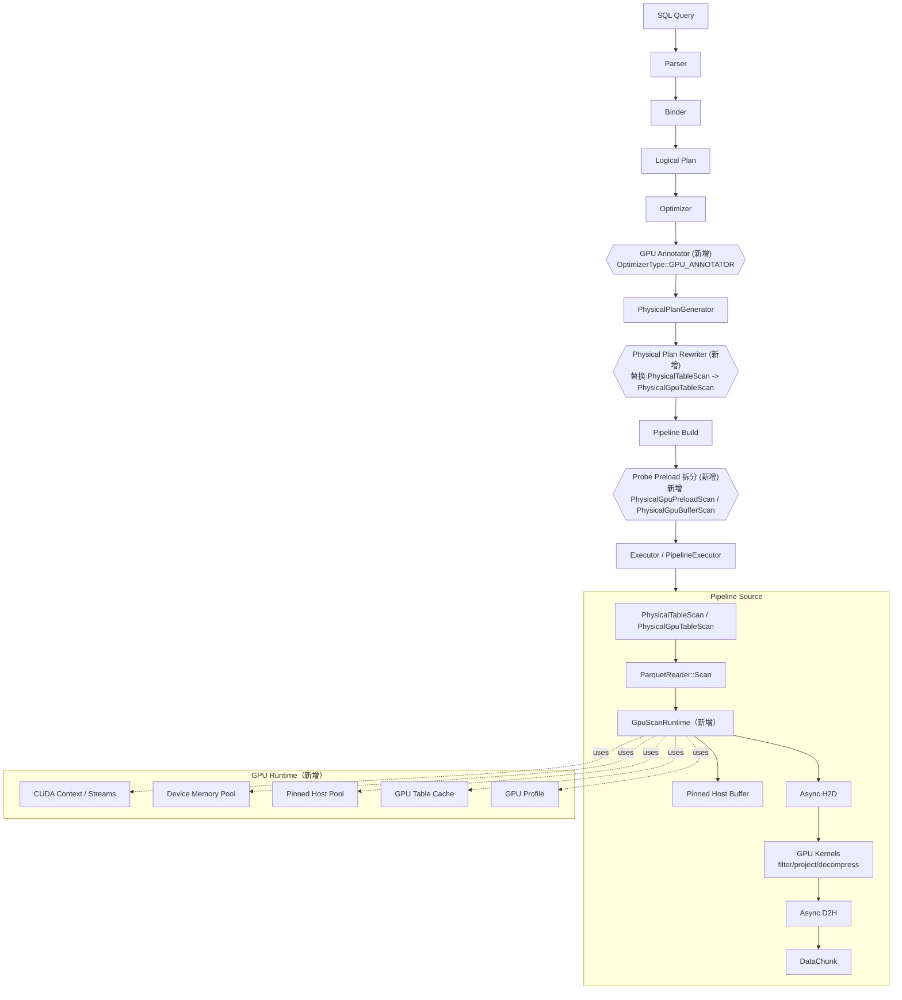
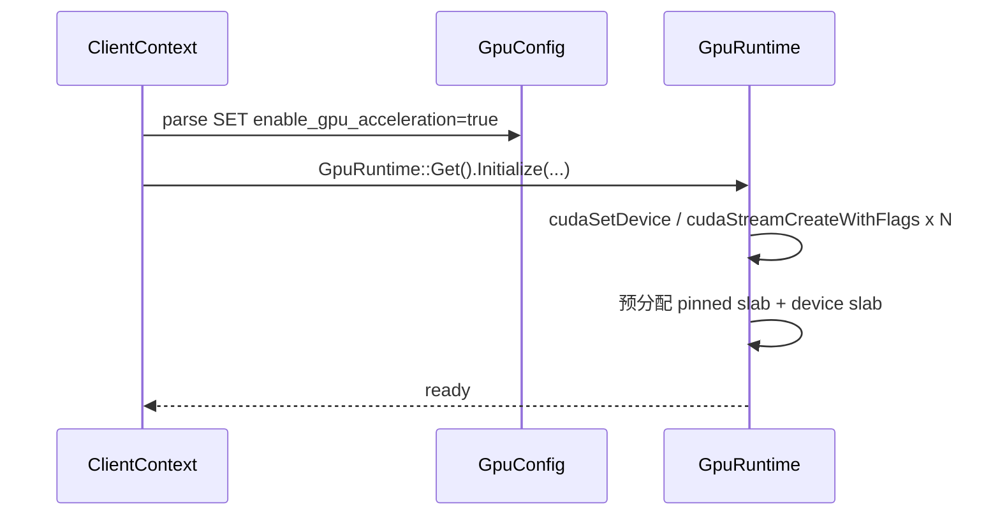
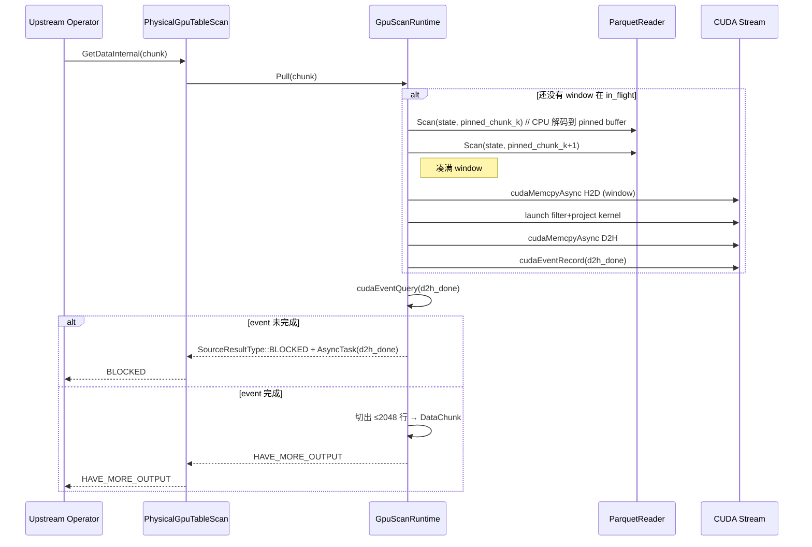
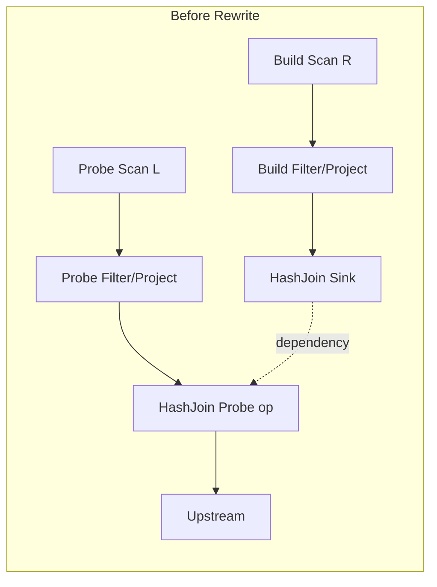
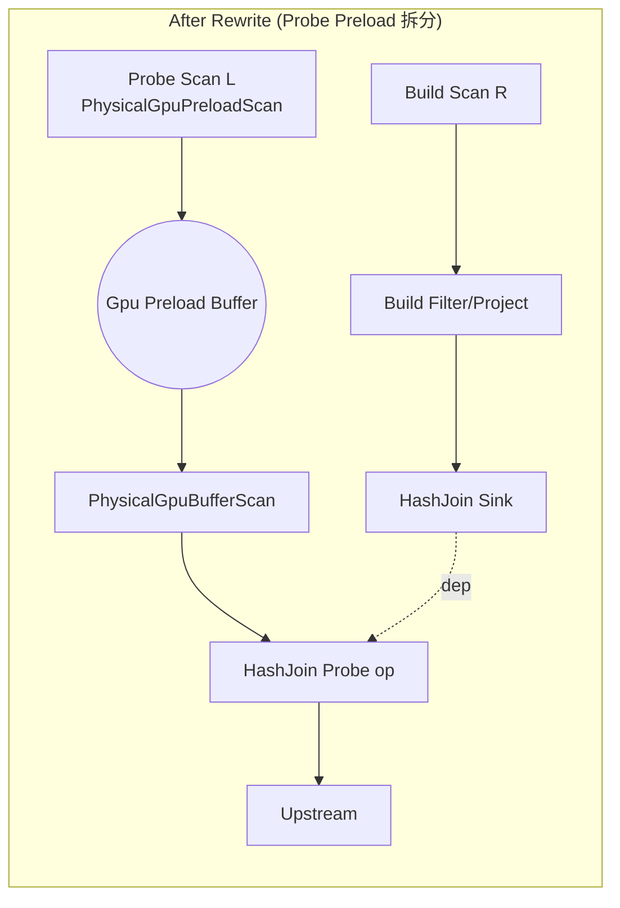
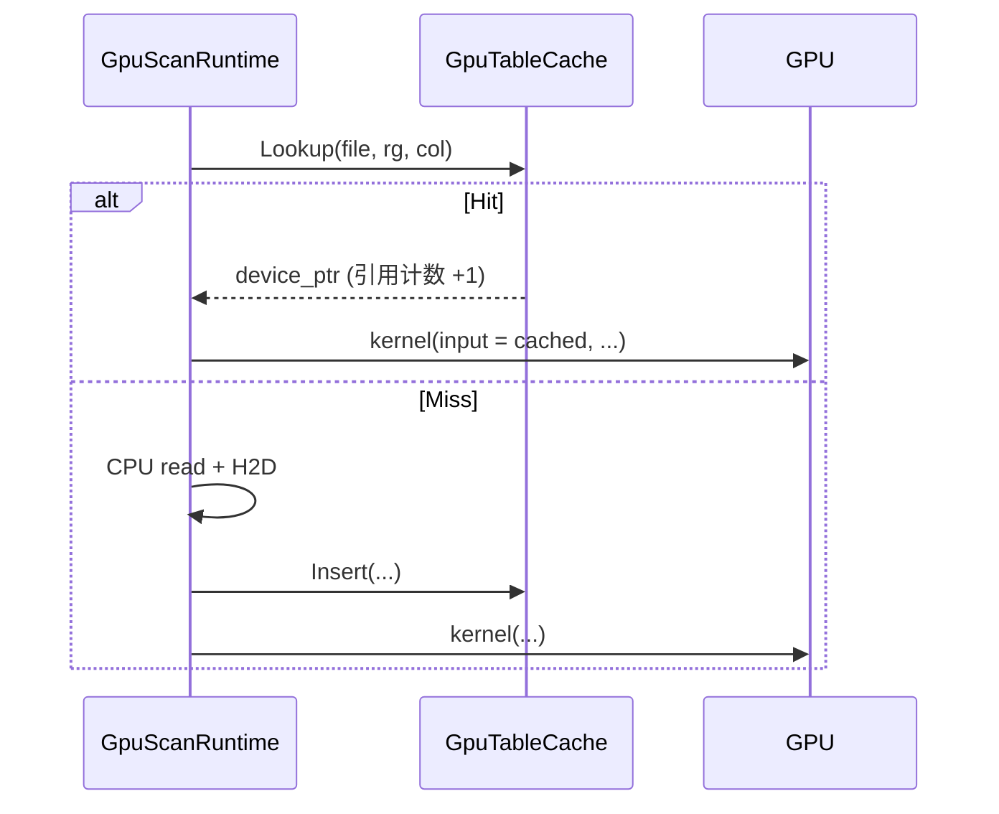
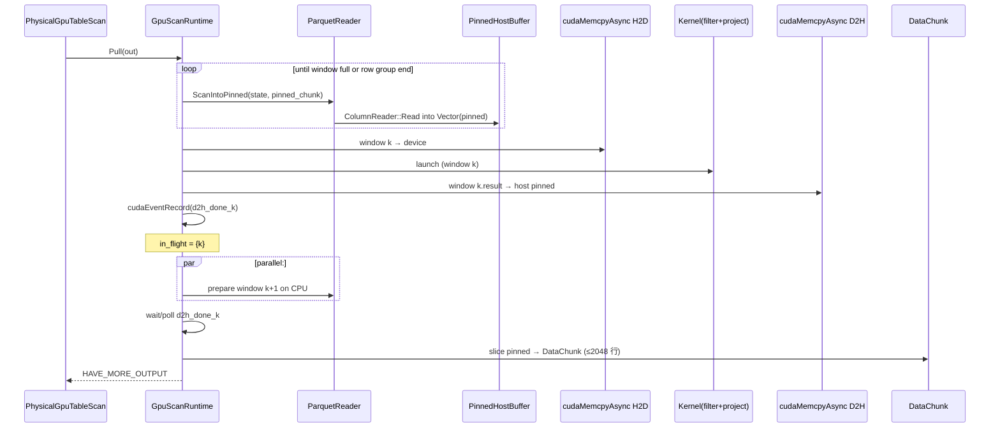

# DuckDB GPU 加速 TPCH/TPCDS Parquet 查询详细设计

> 本文档遵循「需求/架构/详设/接口/数据/改动/部署/风险」八段式工程详设规范。
> 由于本项目是在 DuckDB（已存在的、稳定的 C++ OLAP 引擎）上做异构加速改造，每一节除模块设计外，会显式列出**对既有代码的改动位置（文件、函数、行）**与**改动方式（包装 / 新增 / Hook / 替换）**。

---

## 0. 文档约定与模板说明

### 0.1 详细设计文档标准章节模板

本项目所有详细设计文档（包括本文）均采用如下统一章节模板，便于评审、归档与跨团队对齐：

```text
1. 文档信息与变更历史
2. 名词与缩略语表
3. 需求与目标（含非目标）
4. 现状与差距分析（含对既有代码的关键路径剖析）
5. 总体架构设计
   5.1 架构图
   5.2 模块划分
   5.3 与外部系统/外部代码（cuDF/Arrow/RAPIDS 等）的集成边界
6. 核心模块详细设计（每个模块按下列子节展开）
   6.x.1 模块职责
   6.x.2 数据结构（含字段语义、所有权、生命周期）
   6.x.3 接口定义（C++ 头/类/函数签名）
   6.x.4 关键流程（含时序图 / 状态机）
   6.x.5 多方案对比（原因 / 取舍 / 风险）
   6.x.6 对既有代码的改动点（文件+函数+改动方式）
   6.x.7 外部代码复用清单（哪些可复用 / 如何适配）
7. 关键算法与数据流（含零拷贝、流式、计算重叠）
8. 接口与协议（对内/对外）
9. 数据库/存储/缓存/资源管理（含显存、pinned host memory）
10. 配置项与开关
11. 错误处理、回退与降级（fallback）
12. 性能目标与评估方案（基线、对照组、指标）
13. 兼容性、灰度与回滚
14. 测试策略（单元/集成/correctness/perf/regression）
15. 安全、合规与可观测性
16. 工程实施计划与里程碑
17. 风险登记表
18. 开放问题（Open Questions）
附录 A. 既有代码改动汇总表
附录 B. 外部代码（cuDF/Arrow）复用对照表
```

> 说明：本模板适配「在已有大型项目上做改造」的场景，强制要求第 6 章每个模块都显式列出改动点与外部复用清单（即 6.x.6 与 6.x.7）。

### 0.2 与初步设计的关系

- 初步设计文档：`a_idea/初步设计_2.md`，确定了「最小侵入、渐进验证、可回退、cost 模型门控」等顶层原则，确定了方案 A/B/C 三步走与 Q6→Q3 的 MVP 路径。
- 本详细设计：在此基础上落实到代码级（DuckDB 源码具体文件/函数）、API 级（GPU runtime 抽象）、模块级（具体多方案对比与选型）。

---

## 1. 文档信息与变更历史

| 版本 | 日期 | 作者 | 变更说明 |
| ---- | ---- | ---- | -------- |
| v0.1.0 | 2026-06-26 | GPU Team | 初稿。落实方案 A，给出方案 B/C 接口预留 |

---

## 2. 名词与缩略语

| 缩略语 | 全称 / 含义 |
| ------ | ----------- |
| DuckDB | 嵌入式列式分析数据库 |
| TPCH / TPCDS | 标准 OLAP benchmark |
| RG | Row Group（Parquet 行组） |
| H2D / D2H | Host-to-Device / Device-to-Host PCIe 传输 |
| SM | GPU Streaming Multiprocessor |
| GDS | NVIDIA GPUDirect Storage |
| cuDF | RAPIDS GPU DataFrame，含 GPU Parquet reader / 表达式执行 |
| libcudf | cuDF 的 C++ 内核库 |
| Arrow GPU | Apache Arrow 的 GPU 缓冲区扩展 + nvcomp |
| nvcomp | NVIDIA GPU 解压库（SNAPPY/ZSTD/LZ4/Deflate 等） |
| Pinned Memory | `cudaHostAlloc` 分配的页锁定内存，可异步 H2D |
| `DataChunk` | DuckDB 的列式批数据结构，最大 `STANDARD_VECTOR_SIZE`（默认 2048）行 |
| Pipeline | DuckDB 的 push 模式执行单元，由 source/operators/sink 组成 |
| MetaPipeline | 多个共享同一 sink 的 Pipeline 集合 |

---

## 3. 需求与目标

### 3.1 业务需求

在 DuckDB 现有 SQL/optimizer/执行框架下，对 TPCH/TPCDS Parquet 查询提供 GPU 加速能力，覆盖：

1. **scan-bound 查询**（如 TPCH Q6、TPCDS Q1）：通过 GPU filter/projection 减少 CPU 计算开销。
2. **build/probe 重叠场景**（如 TPCH Q3/Q12、TPCDS Q72）：通过 probe 侧 preload 与 build 重叠，缩短关键路径。
3. **同表多次扫描场景**（TPCDS 中 store_sales 多次出现的查询，如 Q4/Q11/Q74）：通过 GPU table cache 减少重复 IO/decode。

### 3.2 功能性需求

- F1：新增 GPU runtime（CUDA 上下文、stream pool、显存管理、pinned host buffer）。
- F2：在保留 CPU 路径的前提下，新增 GPU scan 路径，能产出与 CPU 路径**逐行一致**的 `DataChunk`。
- F3：在保留原 pipeline 拓扑的前提下，可选地拆出 probe preload pipeline。
- F4：提供查询级 GPU table cache，支持以 `(file, row_group, column_id)` 为粒度。
- F5：提供 GPU 路径开关、配置项、`EXPLAIN` 标注、profile 指标。
- F6：所有 GPU 路径在异常 / 不支持 / 显存不足时**自动回退到 CPU 原路径**，对外语义不变。

### 3.3 非功能性需求

- N1：CPU 路径性能不退化（关闭 GPU 时为 nop）。
- N2：单元测试覆盖率不低于 70%；correctness 测试在 SF1/SF10 上 22 条 TPCH 全通。
- N3：GPU 模块为可选编译（`-DENABLE_CUDA=ON`），关闭时不引入任何 CUDA 依赖。
- N4：保持 `DataChunk` 对外语义完全不变；CPU 调用方**不需要**感知 GPU 的存在。

### 3.4 非目标（Out of Scope）

- 不重写 parser、binder、physical planner 主框架。
- 不在初期实现 GPU hash join / GPU group by / GPU sort 完整算子。
- 不实现 GDS 直读（保留接口）。
- 不在初期改造 DuckDB 的 storage manager（仅作用于 Parquet 外部表）。
- 不支持 nested 类型（list/struct/map）的 GPU 路径；MAP 到 CPU fallback。

### 3.5 MVP 与里程碑（与初步设计一致，但补充 TPCDS）

| 里程碑 | 查询 | 目标 |
| ------ | ---- | ---- |
| M1 | TPCH Q6 / TPCDS Q1 | 验证方案 A：CPU 读 + GPU filter/projection |
| M2 | TPCH Q3 / TPCH Q12 / TPCDS Q72 | 验证方案 C：probe preload + build 重叠 |
| M3 | TPCDS Q4 / Q11 / Q74（store_sales 多次扫描） | 验证 GPU Table Cache 命中收益 |
| M4 | 集成 nvcomp + cuDF Parquet decode | 验证方案 B：GPU 解压 + decode |
| M5 | optimizer rule + cost model | 自动选择 GPU 路径 |

> **TPCDS MVP 调研结论**：与 TPCH 不同，TPCDS 中 `store_sales` 在 17+ 条查询里被重复扫描，是验证 GPU Table Cache 的天然场景。Q1/Q6/Q72 既有大表 scan 又有 hash join build/probe，是与 TPCH Q3/Q6 等价的良好对照组。

---

## 4. 现状分析：DuckDB 关键执行路径

> 本节是后续模块设计的**基线**，所有改动位置都引用本节标识的代码点。

### 4.1 端到端查询执行链路

```text
SQL
 └─> Parser           (src/parser/*)
 └─> Binder           (src/planner/binder/*)
 └─> Logical Plan     (LogicalOperator tree)
 └─> Optimizer        (src/optimizer/*)              [4.4 节展开]
 └─> Physical Plan    (src/execution/physical_plan_generator.cpp)
 └─> Executor         (src/parallel/executor.cpp)    [4.3 节展开]
       ├── MetaPipeline::Build → BuildPipelines() (递归)
       ├── PipelineExecutor::Execute() → FetchFromSource() → GetData()
       └── source = PhysicalTableScan(parquet_scan)  [4.2 节展开]
```

关键入口（来自代码搜索）：

- 查询入口：[client_context.cpp](/data/workspace/database/duckdb-cuda/src/main/client_context.cpp) 中 `Optimizer::Optimize` → `PhysicalPlanGenerator::Plan`。
- Pipeline 构建入口：[executor.cpp](/data/workspace/database/duckdb-cuda/src/parallel/executor.cpp) `Executor::InitializeInternal`，`MetaPipeline::Build`。
- Pipeline 执行入口：[pipeline_executor.cpp](/data/workspace/database/duckdb-cuda/src/parallel/pipeline_executor.cpp) `PipelineExecutor::FetchFromSource` / `GetData`。

### 4.2 Parquet Scan 调用链（**GPU 主接入面**）

```text
PipelineExecutor::FetchFromSource
  -> PipelineExecutor::GetData
    -> pipeline.source->GetData(...)
      -> PhysicalTableScan::GetDataInternal       // src/execution/operator/scan/physical_table_scan.cpp:159
        -> function.function(context, data, chunk)
          -> MultiFileFunction<ParquetMultiFileInfo>::Function   // 通用多文件 scan
            -> ParquetReader::Scan(...)            // extension/parquet/parquet_multi_file_info.cpp:704
              -> ParquetReader::Scan(state, chunk) // extension/parquet/parquet_reader.cpp:1333
                -> 内部三段：
                   (a) 切换 row group + 预取 (line 1340~1395)
                   (b) filter 路径：先读 filter 列 → Select / SelectionVector → 读其余列 (line 1462~1520)
                   (c) 无 filter 路径：依次 ColumnReader::Read 每列 (line 1522~1541)
```

关键观察：

- 实际 IO + 解码发生在 `ColumnReader::Read / Select / Filter`（见 [column_reader.cpp](/data/workspace/database/duckdb-cuda/extension/parquet/column_reader.cpp) 中 `ColumnReader::ReadInternal` 第 663 行）。
- `STANDARD_VECTOR_SIZE = 2048`（[vector_size.hpp](/data/workspace/database/duckdb-cuda/src/include/duckdb/common/vector_size.hpp)）是单次 `DataChunk` 上限，但**与 row group 大小无关**——row group 通常 64K~1M 行。
- Filter pushdown 已在 reader 层实现（`filters` 字段、`AdaptiveFilter`、`SelectionVector`），GPU 路径必须保持等价语义。
- 任务并行粒度：`ParquetMultiFileInfo::TryInitializeScan`（[parquet_multi_file_info.cpp:679](/data/workspace/database/duckdb-cuda/extension/parquet/parquet_multi_file_info.cpp)）按 row group 给每个线程派发一个 row group。这是 GPU 批处理的天然边界。

### 4.3 Pipeline 与 Hash Join Build/Probe 依赖

来自 [physical_join.cpp](/data/workspace/database/duckdb-cuda/src/execution/operator/join/physical_join.cpp) 中 `PhysicalJoin::BuildJoinPipelines`：

```text
对 PhysicalHashJoin op：
  1) state.AddPipelineOperator(current, op)              // 把 join 加入当前（probe）pipeline 作为 operator
  2) child_meta_pipeline = meta_pipeline.CreateChildMetaPipeline(current, op, JOIN_BUILD)
     child_meta_pipeline.Build(op.children[1])           // 构建 RHS（build 侧）pipeline
     // 在 MetaPipeline::CreateChildMetaPipeline 里：current.AddDependency(child_meta_pipeline.GetBasePipeline())
  3) op.children[0].BuildPipelines(current, meta_pipeline)  // 继续构建 LHS（probe 侧）pipeline
```

也就是说：

```text
                ┌─ Build MetaPipeline (RHS scan -> ... -> HashJoin sink)
ProbePipeline ──┤
                └─ depends on Build base pipeline (current.AddDependency)
ProbePipeline = LHS scan -> ... -> HashJoin (as operator) -> 上游 sink
```

**关键点**：当前 ProbePipeline 整体 depends-on Build，意味着 ProbePipeline 中 LHS scan 也被动等待 Build 完成。但实际上：

- LHS scan + 其上确定性 filter / projection **不依赖** hash table。
- 只有 Hash Join probe operator 本身依赖 hash table。

这正是初步设计 6.2 节提出的「拆分 probe preload」的代码切入点（详见 6.4 节）。

### 4.4 Optimizer 入口

来自 [client_context.cpp](/data/workspace/database/duckdb-cuda/src/main/client_context.cpp:432)：

```cpp
Optimizer optimizer(*logical_planner.binder, *this);
logical_plan = optimizer.Optimize(std::move(logical_plan));
...
PhysicalPlanGenerator physical_planner(*this);
result->physical_plan = physical_planner.Plan(std::move(logical_plan));
```

`Optimizer::Optimize` 内部按枚举 `OptimizerType` 顺序运行规则（见 [optimizer_type.cpp](/data/workspace/database/duckdb-cuda/src/common/enums/optimizer_type.cpp)）。新增 GPU 相关规则的位置见 6.7 节。

### 4.5 现状差距小结

| 现状 | 差距 | 解决章节 |
| ---- | ---- | -------- |
| Parquet scan 完全 CPU；`ColumnReader::Read` 单线程 decode | 缺 GPU 解压/decode/filter 路径 | 6.2 / 6.3 |
| `STANDARD_VECTOR_SIZE = 2048` 太小，无法摊薄 H2D 开销 | 需要在 GPU 内部维持更大的「window」 | 6.2.4 |
| ProbePipeline 整体 depends-on Build | 需要将 probe scan 拆出独立 preload pipeline | 6.4 |
| Optimizer 无 GPU 感知 | 需要 GPU annotator + cost 调整 | 6.7 |
| 无显存/pinned host memory 管理 | 需要 GPU runtime + buffer pool | 6.1 |

---

## 5. 总体架构设计

### 5.1 分层架构图



### 5.2 模块清单

| ID | 模块 | 主要职责 | 详设章节 |
| -- | ---- | -------- | -------- |
| M-RT | GpuRuntime | CUDA Context / Stream Pool / 设备内存 / pinned host pool / 错误处理 | 6.1 |
| M-SCAN | GpuScanRuntime | scan 内的批组装、H2D/D2H、kernel launch、回填 DataChunk | 6.2 |
| M-EXPR | GpuExprExecutor | filter / projection 表达式编译到 GPU kernel（thrust / cudf::ast / 自研） | 6.3 |
| M-PIPE | GpuPipelineRewriter | 拆分 probe pipeline，新增 PreloadScan/BufferScan | 6.4 |
| M-CACHE | GpuTableCache | 查询内 row group + column 粒度缓存 | 6.5 |
| M-DEC | GpuParquetDecoder（B 阶段） | 调用 nvcomp / cudf 在 GPU 解压、decode Parquet page | 6.6 |
| M-OPT | GpuOptimizer | logical 阶段标注 + cost 调整 + physical 阶段重写 | 6.7 |
| M-CFG | GpuConfig | 配置开关、`SET enable_gpu=...`、profile 输出 | 6.8 |
| M-EXP | GpuExperimentHook | 计划 dump / 注入入口（实验阶段） | 6.9 |

### 5.3 与外部代码集成边界

| 外部项目 | 作为 | 集成方式 | 替代方案 |
| -------- | ---- | -------- | -------- |
| **CUDA Toolkit** | 必备依赖 | 通过 `find_package(CUDAToolkit REQUIRED)` 引入 driver+runtime | 无替代 |
| **cuDF (libcudf)** | 主选 GPU Parquet 解压 + 表达式执行 | 静态/动态链接 libcudf；通过 `cudf::io::read_parquet` 与 `cudf::ast::expression` 调用 | 见 6.3.5 |
| **Apache Arrow GPU** | 备选；统一 H2D 数据格式 | 仅复用 `arrow::cuda::CudaBuffer` 抽象，避免引入完整 Arrow 依赖 | cuDF 自带 |
| **nvcomp** | 主选 GPU 解压（SNAPPY/ZSTD） | 直接链接 `libnvcomp`；libcudf 内部已用 nvcomp，但允许直接调用以脱离 cudf 依赖 | 自研解压（不可行） |
| **Thrust / CUB** | 基础并行原语（scan、sort、reduce、selection） | 头文件依赖 | 无替代 |

> 集成原则：**libcudf 仅作为「kernel 仓库」而非「执行引擎」**。我们不接管 cudf 的 column / table 类型作为 DuckDB 内部表示，而是在 GpuScanRuntime 的边界处把 `cudf::table` 转为 DuckDB `DataChunk`，避免侵入 DuckDB 类型系统。详见 6.3.7 与附录 B。

### 5.4 编译与可选依赖

新增 CMake 选项（位置：[CMakeLists.txt](/data/workspace/database/duckdb-cuda/CMakeLists.txt)，根目录）：

```cmake
option(ENABLE_CUDA "Enable CUDA-based GPU acceleration" OFF)
option(ENABLE_GPU_CUDF "Use libcudf for GPU Parquet decode/expr (requires ENABLE_CUDA)" OFF)
option(ENABLE_GPU_NVCOMP "Use nvcomp for GPU decompression (requires ENABLE_CUDA)" OFF)
```

关闭时所有 GPU 路径代码被 `#ifdef DUCKDB_ENABLE_CUDA` 跳过；CPU 路径完全不变。

---

## 6. 核心模块详细设计

### 6.1 M-RT：GPU Runtime

#### 6.1.1 模块职责

- 负责进程内**单例**的 CUDA 上下文初始化、销毁。
- 维护 stream pool（默认 4 个非阻塞 stream），供 scan/preload/cache 复用。
- 提供设备内存池（避免 cudaMalloc 频繁调用）与 pinned host buffer pool。
- 提供错误码翻译（`cudaError_t` → `duckdb::Exception`）。
- 提供 lazy init：只有第一次启用 GPU 路径时才真正初始化，避免影响 CPU-only 用户。

#### 6.1.2 数据结构

```cpp
// src/include/duckdb/execution/gpu/gpu_runtime.hpp（新增）
namespace duckdb {

struct GpuRuntimeConfig {
    idx_t device_memory_limit_bytes = 0;     // 0 = 80% of free
    idx_t pinned_memory_limit_bytes = 0;     // 0 = 1 GB default
    idx_t num_streams = 4;
    int   device_ordinal = 0;
};

class GpuStream;          // RAII 包装 cudaStream_t
class GpuDeviceBuffer;    // RAII 包装 cudaMalloc / cudaFree
class GpuPinnedBuffer;    // RAII 包装 cudaHostAlloc / cudaFreeHost

class GpuMemoryPool;      // slab allocator，2^k 大小桶；fallback 直接 cudaMalloc
class GpuPinnedPool;      // 同上，host 端

class GpuRuntime {
public:
    static GpuRuntime &Get();              // 进程单例
    bool IsAvailable() const;              // 探测：是否有 CUDA 设备 + 能初始化
    void Initialize(const GpuRuntimeConfig &cfg);
    void Shutdown();

    GpuStream      &AcquireStream();       // 轮询/LRU 分配
    void            ReleaseStream(GpuStream &s);

    GpuMemoryPool  &DeviceMemory();
    GpuPinnedPool  &PinnedMemory();

    // 用于 cost model 与回退判断
    idx_t  FreeDeviceMemory() const;
    idx_t  TotalDeviceMemory() const;
};

} // namespace duckdb
```

#### 6.1.3 接口

- `GpuRuntime::Get()`：单例入口。
- `GpuRuntime::IsAvailable()`：cost model 在选 GPU 路径前调用。
- `GpuMemoryPool::Allocate(size, stream)` / `Free(ptr, stream)`：异步释放（stream-ordered allocator）。

#### 6.1.4 关键流程

懒初始化时序：



#### 6.1.5 多方案对比：内存池实现

| 方案 | 描述 | 优点 | 缺点 / 风险 | 选型 |
| ---- | ---- | ---- | ----------- | ---- |
| (A) 直接 `cudaMalloc/Free` 每次调用 | 简单 | 无锁 | cudaMalloc 同步开销大；阻塞 stream | ❌ |
| (B) 自研 slab allocator（按 power-of-2） | 分桶；O(1) 分配 | 可控；与 stream 解耦 | 内存碎片 | ⚠ 备选 |
| (C) **CUDA 11+ stream-ordered memory allocator (`cudaMallocAsync`)** | 内置异步内存池 | 与 stream 完美配合；CUDA 官方推荐 | 需 CUDA ≥ 11.2，driver ≥ 450 | ✅ **首选** |
| (D) RMM (RAPIDS Memory Manager) | RAPIDS 标准 | 与 cudf 共享 pool；统一统计 | 引入 RMM 依赖 | ✅ 当 ENABLE_GPU_CUDF=ON 时使用 |

**选型**：默认 (C)，当启用 cudf 时切换到 (D) 以与 cudf 共享内存池，避免双 pool 浪费。

#### 6.1.6 对既有代码的改动点

| 位置 | 改动方式 | 说明 |
| ---- | -------- | ---- |
| [CMakeLists.txt](/data/workspace/database/duckdb-cuda/CMakeLists.txt)（根） | 新增 | 增加 ENABLE_CUDA、CUDA toolkit / cudf / nvcomp 查找 |
| `src/execution/CMakeLists.txt` | 新增子目录 | `add_subdirectory(gpu)` |
| `src/execution/gpu/`（新增目录） | 新增 | `gpu_runtime.cpp/hpp`，`gpu_memory_pool.cpp`，`gpu_pinned_pool.cpp`，`gpu_stream.cpp` |
| [client_context.cpp](/data/workspace/database/duckdb-cuda/src/main/client_context.cpp) | hook | 在 `ClientContext::Cleanup` 时，可选 `GpuRuntime::Get().Shutdown()`（当前进程最后一个 context 关闭时） |
| [config.cpp](/data/workspace/database/duckdb-cuda/src/main/config.cpp) | 新增 ExtensionOption | 注册 `enable_gpu_acceleration`、`gpu_memory_limit` 等（见 10 节） |

> **本模块不修改任何 DuckDB 现有逻辑文件的执行路径**——只新增文件 + CMake + 注册若干配置项。

#### 6.1.7 外部代码复用清单

| 来源 | 复用对象 | 复用形式 |
| ---- | -------- | -------- |
| CUDA Runtime | `cudaStream_t`、`cudaMallocAsync`、`cudaMemcpyAsync` | 直接调用 |
| RMM（可选） | `rmm::cuda_async_memory_resource`、`rmm::mr::pool_memory_resource` | 包装为 `GpuMemoryPool` 后端 |
| Thrust（可选） | 不在本模块直接使用 | — |

---

### 6.2 M-SCAN：GpuScanRuntime（方案 A 核心）

> 这是初步设计 5.1 节方案 A 的落地模块；同时为方案 B/C 提供基础。

#### 6.2.1 模块职责

将「CPU 读出来的若干个 `DataChunk`」聚成一个 GPU 友好的大 batch（称为 **GPU window**），异步送到 GPU，执行 filter/projection，再切回 `DataChunk` 输出给上游 pipeline。**对上游完全保留 `DataChunk` 语义**。

#### 6.2.2 关键决策（响应初步设计 2.2 节三个未决问题）

##### 决策 1：是否新增 `parquet_gpu_scan` 算子 vs 在 `parquet_scan` 内 if-else

| 方案 | 描述 | 优点 | 缺点 | 选型 |
| ---- | ---- | ---- | ---- | ---- |
| (A) 新增独立 table function `parquet_gpu_scan` | 在 [parquet_extension.cpp:854](/data/workspace/database/duckdb-cuda/extension/parquet/parquet_extension.cpp) 内额外注册一个 TableFunction | optimizer 可显式选择；plan 可读性好；CPU 路径完全无侵入 | 代码重复（两份 bind/init/cleanup）；`replacement_scan` 仍指向 `parquet_scan` | ⚠ |
| (B) 在 `parquet_scan` 内通过 bind data 上的 flag 分支 | `MultiFileBindData` 内增加 `gpu_mode_t`，在 `ParquetReader::Scan` 入口分发 | 入口统一；可被 optimizer 灵活切换；filter pushdown / row group pruning 全复用 | 单文件代码体量增加 | — |
| (C) **新增 PhysicalGpuTableScan 物理算子，复用 parquet_scan table function** | 在 PhysicalPlanGenerator 阶段，对满足条件的 PhysicalTableScan 替换为 PhysicalGpuTableScan；其内部仍调用 ParquetReader 的 CPU 入口，但在 GetDataInternal 包装一层 GpuScanRuntime | 解耦：scan 算子层级做 GPU 包装；CPU 路径不动；可对非 parquet（未来 csv/iceberg）复用 | 多了一个物理算子类型，但只是包装 | ✅ **首选** |

**选型理由**：
- DuckDB 既有 `replacement_scan` / `MultiFileFunction` 体系已经把 parquet 实现做得非常通用，再写一个 `parquet_gpu_scan` 收益小、重复度高。
- 在 table function 内部做 if-else 会污染 [parquet_reader.cpp](/data/workspace/database/duckdb-cuda/extension/parquet/parquet_reader.cpp) 这个核心文件。
- 在 PhysicalOperator 层包装是最自然的——和 DuckDB `PhysicalCachingOperator`、`PhysicalAdaptiveProbe` 的设计哲学一致。

##### 决策 2：GPU window 大小、是否保持 DataChunk 语义传输到 GPU

| 方案 | window 大小 | 是否在 H2D 时保持 DataChunk 边界 | 优点 | 缺点 |
| ---- | ----------- | -------------------------------- | ---- | ---- |
| (A) `STANDARD_VECTOR_SIZE = 2048` 直接送 | 2048 行 / 次 H2D | 是 | 实现最简单；与 CPU 1:1 对应 | PCIe 利用率极差，每次 H2D 启动开销 ~10μs，2048×8B=16KB，带宽 < 1.6GB/s |
| (B) **CPU 累积 N 个 DataChunk → 一个 GPU window** | 默认 64 K~256 K 行（可配置 `gpu_scan_window_rows`） | 否：内部 column buffer 拼接 | 摊薄 H2D / kernel launch；可流水化 | 累积期间内存翻倍；最后一个 row group 不足时凑不满 |
| (C) 一次 row group 一个 window | RG 内全部行（典型 64K~1M） | 否 | 与 Parquet 物理粒度对齐；自然零碎拼接 | 极大 row group 时显存压力；首批延迟高 |

**选型**：(B) **可配置默认 64K**；上限按 `min(row_group_remaining, gpu_scan_window_rows, free_device_memory / row_size)` 取小。

> CPU 不需要也不应该感知 GPU window；window 完全是 GpuScanRuntime 的内部概念。CPU 上游通过 `GetDataInternal` 看到的依然是 ≤2048 行的 DataChunk。

##### 决策 3：流式传输、CPU↔GPU 零拷贝、传输/计算重叠的具体技术

| 维度 | 选用技术 |
| ---- | -------- |
| 流式传输 | CUDA stream + `cudaMemcpyAsync` + `cudaEvent_t` 顺序保证 |
| Pinned host 与 DataChunk 零拷贝 | 在 ParquetReader 写入侧使用 **Pinned-backed Vector 分配器**（见 6.2.6），让 ColumnReader::Read 直接写到 pinned buffer |
| H2D + kernel 重叠 | 双缓冲（ping-pong window）：window k 在 GPU 计算 / window k+1 在 H2D / window k+2 在 CPU 准备 |
| D2H + 下游 pipeline 重叠 | D2H 写回到下一个 pinned buffer；同时 CPU 上游 operator 可以处理上一个 DataChunk |
| 同步原语 | 每个 window 一个 `cudaEvent_t`，上游 `GetDataInternal` 在 D2H 完成事件上 `cudaEventSynchronize`（或在异步 source 路径返回 `BLOCKED` + 事件 callback） |

**注**：DuckDB scan 的 `AsyncResult` 已经支持 `BLOCKED` 状态（见 [physical_table_scan.cpp:159 GetDataInternal](/data/workspace/database/duckdb-cuda/src/execution/operator/scan/physical_table_scan.cpp)），可以将 `cudaEventQuery` 包装为 `AsyncTask`，避免阻塞工作线程。这是 GPU 与 DuckDB 异步 scan 框架天然契合的关键点。

#### 6.2.3 数据结构

```cpp
// src/include/duckdb/execution/gpu/gpu_scan_runtime.hpp（新增）

struct GpuScanWindow {
    idx_t row_count;
    vector<GpuDeviceBufferRef> device_columns;   // 输入列在 device 上的指针
    vector<GpuPinnedBufferRef> pinned_staging;   // host pinned 端
    GpuDeviceBufferRef sel_vec;                  // GPU 端 SelectionVector
    cudaEvent_t h2d_done;
    cudaEvent_t kernel_done;
    cudaEvent_t d2h_done;
    GpuStream  &stream;
};

class GpuScanRuntime {
public:
    GpuScanRuntime(ClientContext &ctx, const PhysicalGpuTableScan &op,
                   GpuScanRuntimeConfig cfg);

    // 由 PhysicalGpuTableScan::GetDataInternal 调用
    SourceResultType Pull(ExecutionContext &ctx, DataChunk &output_chunk,
                          OperatorSourceInput &input);

private:
    // ① 从底层 ParquetReader 拉若干 DataChunk，写入 pinned 缓冲，组装成 window
    bool TryFillWindow(GpuScanWindow &win);
    // ② 启动 H2D + kernel + D2H
    void LaunchWindow(GpuScanWindow &win);
    // ③ 等待某个 window 的 d2h_done，切片成 DataChunk
    bool DrainWindowToChunk(GpuScanWindow &win, DataChunk &out);

    queue<unique_ptr<GpuScanWindow>> in_flight_;     // FIFO，保证 batch index 顺序
    GpuScanRuntimeConfig cfg_;
    // 反压：当 in_flight_.size() >= cfg_.max_in_flight_windows 时停止 fill
};
```

#### 6.2.4 关键流程



#### 6.2.5 多方案对比：CPU→GPU 数据搬运的零拷贝实现

| 方案 | 描述 | 优点 | 缺点 | 选型 |
| ---- | ---- | ---- | ---- | ---- |
| (A) 普通 `Vector` → `cudaMemcpy`（pageable） | 使用 DuckDB 默认 `BufferAllocator` 分配的 host 内存 | 改动最小 | pageable memory 同步拷贝；驱动会先 staging 到 pinned，吞吐 ~6 GB/s 上限 | ❌ |
| (B) **自定义 PinnedAllocator + 让 ColumnReader::Read 写到 pinned buffer** | 实现 `Allocator` 子类 `PinnedHostAllocator`，在 `ParquetReader::ReadDataChunk` 路径上替换 | 真正异步 H2D；带宽接近 PCIe 极限；对上层透明 | 需要在 `Vector` 创建处指定 allocator；需要在 ScanState 维护一个 pinned 池 | ✅ |
| (C) Unified Memory (`cudaMallocManaged`) | 让 GPU 直接访问 CPU 写入的内存 | 实现简单 | page fault 开销大、性能不确定；TPCH-Q6 实测劣于 pinned async | ⚠ 仅作为 fallback |
| (D) GPUDirect Storage（GDS） | SSD 直读 GPU 显存，绕过 CPU | 最优带宽 | 仅 H100/A100 + 特定 NVMe；与现有 ParquetReader 解耦工作量大 | 留给方案 B/C 后期 |

**选型**：(B) 为主，(C) 仅在小数据 fallback；(D) 长期目标。

#### 6.2.6 对既有代码的改动点

| 文件 / 函数 | 改动类型 | 说明 |
| ----------- | -------- | ---- |
| `src/execution/operator/scan/physical_gpu_table_scan.{cpp,hpp}` | **新增** | 包装 `PhysicalTableScan` 的 GPU 版；构造时持有原 `PhysicalTableScan &` 引用以复用 bind_data / table_filters |
| [physical_plan_generator.cpp](/data/workspace/database/duckdb-cuda/src/execution/physical_plan_generator.cpp) | hook | 在 `PlanInternal` 之后增加 `GpuPhysicalPlanRewriter::Rewrite(physical_plan)` 调用（带开关） |
| [parquet_reader.cpp:1333 ParquetReader::Scan](/data/workspace/database/duckdb-cuda/extension/parquet/parquet_reader.cpp) | **不修改主体**；仅在 1462–1541 行抽出 `ScanCpuOnly` 与 `ScanIntoPinned` 的内部小函数 | 让 GpuScanRuntime 可以 reuse 原 scan 的 row group 切换、filter、prefetch 全部逻辑，仅替换最内层的写入目标 buffer |
| [parquet_multi_file_info.cpp:54 ParquetReadGlobalState](/data/workspace/database/duckdb-cuda/extension/parquet/parquet_multi_file_info.cpp) | 扩展（可选字段） | 增加 `unique_ptr<GpuScanRuntime> gpu_runtime`（仅在 GPU 模式下创建） |
| [physical_table_scan.cpp:159 GetDataInternal](/data/workspace/database/duckdb-cuda/src/execution/operator/scan/physical_table_scan.cpp) | **不修改** | GPU 路径走 `PhysicalGpuTableScan::GetDataInternal`；CPU 路径不变 |
| `src/execution/gpu/gpu_scan_runtime.{cpp,hpp}` | 新增 | 本模块主体 |
| `src/execution/gpu/pinned_host_allocator.{cpp,hpp}` | 新增 | `Allocator` 子类，封装 `cudaHostAlloc(... cudaHostAllocPortable)` |

> 关键设计点：**绝不修改 `ColumnReader::Read` 等热路径函数的签名**。我们在 ScanState 内挂一个 `pinned_allocator_override`，由 `ParquetReader::Scan` 在创建 `result.Initialize(...)` 时根据 state 选择 allocator，从而把 decode 输出落到 pinned buffer。

#### 6.2.7 外部代码复用清单

| 来源 | 复用项 | 复用形式 |
| ---- | ------ | -------- |
| CUDA | `cudaMemcpyAsync`、`cudaEventRecord/Query`、`cudaMallocAsync` | H2D / D2H / 事件同步 / 设备内存 |
| Thrust | `thrust::copy_if`、`thrust::transform` | filter selection vector 生成、简单 projection |
| cuDF（可选） | `cudf::ast::generate_input_columns`、`cudf::compute_column` | 复杂表达式编译；本模块仅作 fallback，主要在 6.3 模块使用 |
| Apache Arrow | 不直接复用 | — |

---

### 6.3 M-EXPR：GPU 表达式执行（filter / projection）

#### 6.3.1 模块职责

将 DuckDB 的 `Expression` 树（`BoundComparisonExpression`、`BoundConjunctionExpression`、`BoundFunctionExpression` 等）编译为 GPU 可执行代码，输入 `GpuColumnVector`，输出 `SelectionVector`（filter）或新列（projection）。

#### 6.3.2 多方案对比：表达式 → GPU 实现路径

| 方案 | 描述 | 表达力 | 编译/集成成本 | 运行性能 | 选型 |
| ---- | ---- | ------ | ------------- | -------- | ---- |
| (A) **手写 Thrust kernel + 类型派发宏** | 对 ==/</>/AND/OR/NOT/+,-,*/ 提供模板 functor，类型派发 | 有限：常见数值/日期比较 | 低 | 高（无虚调用） | ✅ **MVP（M1）首选** |
| (B) **cuDF AST (`cudf::ast::expression`)** | 把 DuckDB Expression 翻译成 cudf AST 树 | 较高：算术、比较、字符串部分函数 | 中：依赖 libcudf | 高（cudf 内部 JIT 部分支持） | ✅ **M2 起切换** |
| (C) JIT（NVRTC + libcudacxx） | 运行时编译 CUDA 源码 | 极高 | 高 | 编译成本不可忽视 | ❌ 暂不 |
| (D) MLIR / Velox-style codegen | 通用编译器框架 | 极高 | 极高 | 高 | ❌ 长期再评估 |

**选型路线**：M1 用 (A) 实现 TPCH Q6 所需的 4 类谓词（`l_shipdate >= ...`、`l_shipdate < ...`、`l_discount BETWEEN ...`、`l_quantity < ...`）；M2~ 切到 (B)，把 cuDF AST 作为统一表达式后端，仅当 cuDF AST 不支持的表达式才 fallback CPU。

#### 6.3.3 接口

```cpp
// src/include/duckdb/execution/gpu/gpu_expression.hpp
class GpuExpressionExecutor {
public:
    // 编译期：把 DuckDB Expression 树编译为内部 IR
    void AddExpression(const Expression &expr);
    // 运行期：在 GPU 上执行
    void Execute(const GpuChunk &input,           // 列引用
                 GpuChunk      &output);          // projection 结果
    // 用于 filter：返回 selection vector + count
    idx_t SelectFilter(const GpuChunk &input,
                       GpuSelectionVector &sel);
    // 是否所有表达式都能在 GPU 上执行；false → caller fallback CPU
    bool CanExecuteAll() const { return all_supported_; }
};
```

#### 6.3.4 GPU 数据格式（GpuColumnVector）

```cpp
struct GpuColumnVector {
    LogicalType  type;        // 复用 DuckDB 类型
    idx_t        row_count;
    void        *data;        // device ptr
    bitmap_t    *validity;    // device ptr，与 DuckDB ValidityMask 等价语义
    // 仅 STRING / VARCHAR：
    uint32_t    *str_offsets; // device ptr，长度 row_count + 1
    char        *str_data;    // device ptr，连续字节
    // 仅 DICTIONARY：
    optional dict info ...
};
```

> 对外（CPU 端）输出仍是 DuckDB `Vector`/`DataChunk`；`GpuColumnVector` 仅在 GpuScanRuntime / GpuExpressionExecutor 内部使用。

#### 6.3.5 多方案对比：是否在内部直接使用 `cudf::table`

| 方案 | 描述 | 优点 | 缺点 | 选型 |
| ---- | ---- | ---- | ---- | ---- |
| 直接用 `cudf::table` 作为 GPU 端类型 | 把 GpuColumnVector ≡ cudf::column_view | cudf 接口直接可用 | 强依赖 cudf；DuckDB 不启用 cudf 时整个模块编不过 | ❌ |
| **抽象 GpuColumnVector，cudf backend 里转 view** | GpuColumnVector → `cudf::column_view` 仅在 cudf backend 内部转换（零拷贝） | 解耦；可同时存在 thrust backend / cudf backend | 多一层适配代码 ~200 行 | ✅ |

#### 6.3.6 对既有代码的改动点

| 位置 | 改动 |
| ---- | ---- |
| `src/execution/gpu/gpu_expression_executor_thrust.cu` | 新增：M1 用 |
| `src/execution/gpu/gpu_expression_executor_cudf.cpp` | 新增：M2 用，编译条件 `ENABLE_GPU_CUDF` |
| `src/execution/gpu/expression_lowering.cpp` | 新增：DuckDB Expression → 内部 IR / cudf AST 的翻译器 |
| [expression_executor.cpp](/data/workspace/database/duckdb-cuda/src/execution/expression_executor.cpp) | **不修改** | GPU 不复用 CPU executor；保持互不干扰 |

#### 6.3.7 外部代码复用清单

| 来源 | 复用项 | 适配方式 |
| ---- | ------ | -------- |
| **libcudf** | `cudf::ast::*`、`cudf::compute_column`、`cudf::strings::contains` 等 | 在 cudf backend 内 GpuColumnVector → `cudf::column_view` 的零拷贝构造（仅复制元数据：类型 + ptr + size + null mask） |
| **Thrust / CUB** | `thrust::transform`、`cub::DeviceSelect::Flagged` | M1 直接用 |
| **nvcomp** | 不直接使用（属于 6.6 解压模块） | — |
| **arrow::compute** | 不引入；与 cudf 重复且更重 | — |

---

### 6.4 M-PIPE：Probe Preload Pipeline 改造

> 对应初步设计 6 节。

#### 6.4.1 模块职责

为满足条件的 `PhysicalHashJoin`，把 LHS（probe 侧）的 scan + 确定性 filter/projection 拆成独立的 **PreloadPipeline**，使其与 BuildPipeline 并行执行；ProbePipeline 转为从已物化 buffer 读取。

#### 6.4.2 多方案对比

> 初步设计 6.4 节给了三种方式，详设阶段进一步细化：

| 方案 | 描述 | 改动范围 | 优点 | 缺点 / 风险 | 选型 |
| ---- | ---- | -------- | ---- | ----------- | ---- |
| (A) 实验期手动改写 plan（脚本注入） | 仅在 benchmark 入口生效，不进 optimizer | 极小 | 验证快 | 不能上线 | ✅ M2 验证 |
| (B) **新增 PhysicalGpuPreloadScan + PhysicalGpuBufferScan**，由专用 rewriter 在 PhysicalPlan 阶段插入 | 新增 2 个物理算子；新增 1 个 rewriter | 中 | 上线友好；可被 EXPLAIN 看到 | 需要保证 pipeline 拓扑正确 | ✅ **M3 起正式** |
| (C) 在 `PhysicalJoin::BuildJoinPipelines` 内部直接拆 pipeline | 改 [physical_join.cpp:85](/data/workspace/database/duckdb-cuda/src/execution/operator/join/physical_join.cpp) | 大 | 最深度集成 | 风险高；与 DELIM_JOIN/IEJOIN/AsofJoin 都耦合 | ❌ |

**选型**：(A) 用于 M2 实验，(B) 用于正式落地。下面是 (B) 的设计。

#### 6.4.3 数据结构与算子

```cpp
class PhysicalGpuPreloadScan : public PhysicalOperator {
    // 来源：被替换的 LHS scan 子树（其本身是 PhysicalTableScan / PhysicalGpuTableScan + 可选 Filter / Projection）
public:
    bool IsSink() const override   { return true; }    // 把扫到的数据写入 buffer
    bool IsSource() const override { return false; }
    SinkResultType Sink(...) override;                  // 写入 GpuPreloadBuffer
    SinkFinalizeType Finalize(...) override;
};

class PhysicalGpuBufferScan : public PhysicalOperator {
    // 引用同一个 GpuPreloadBuffer
public:
    bool IsSource() const override { return true; }
    SourceResultType GetDataInternal(...) override;
};

class GpuPreloadBuffer {
    // 可放在 GPU 显存（首选）或 CPU pinned buffer（fallback）
    vector<GpuColumnSlice> slices;     // 按 batch 切片，保留 batch index
    atomic<bool> finalized;
    // 多生产者（PreloadScan 多 thread Sink） / 多消费者（BufferScan 多 thread Pull）
};
```

#### 6.4.4 Pipeline 改写流程





#### 6.4.5 Pipeline 拓扑实现细节

在 `PhysicalGpuPreloadScan::BuildPipelines` 中：

1. 创建一个新的 **Preload MetaPipeline**（type 新增 `MetaPipelineType::GPU_PRELOAD`）作为 root pipeline 的 child；以 PreloadScan 自身作为 sink。
2. 把 LHS 子树构建到 Preload MetaPipeline 内。
3. PhysicalGpuBufferScan 出现在原 ProbePipeline 中作为 source。
4. 在 ProbePipeline 上 `AddDependency(preload_meta_pipeline.GetBasePipeline())`——但这是**新加**的依赖；与既有 build 依赖**并列**而非串行。

> 关键正确性约束（与初步设计 6.3 节一致，但代码可执行的形式化）：
> - LHS 子树中允许的算子白名单：`PhysicalTableScan` / `PhysicalGpuTableScan` / `PhysicalFilter`（filter 仅引用 LHS 列） / `PhysicalProjection`（仅确定性、非 volatile 函数）。
> - 任意 volatile 表达式（`Expression::IsVolatile()`）→ 拒绝拆分，回退原 pipeline。
> - LHS 子树包含 join / aggregate / window / cte ref → 拒绝。
> - 上层有 `ORDER BY` 且未在 join 后排序 → 拒绝（避免顺序变更）。

#### 6.4.6 对既有代码的改动点

| 位置 | 改动 |
| ---- | ---- |
| `src/execution/operator/gpu/physical_gpu_preload_scan.{cpp,hpp}` | 新增 |
| `src/execution/operator/gpu/physical_gpu_buffer_scan.{cpp,hpp}` | 新增 |
| `src/execution/gpu/gpu_preload_buffer.{cpp,hpp}` | 新增 |
| [meta_pipeline.hpp / .cpp](/data/workspace/database/duckdb-cuda/src/parallel/meta_pipeline.cpp) | 扩展 enum：`MetaPipelineType::GPU_PRELOAD` | 仅枚举增加，新 case 在 [executor.cpp:227](/data/workspace/database/duckdb-cuda/src/parallel/executor.cpp) join build 依赖建链处对 GPU_PRELOAD 不做 build-build 互依赖处理 |
| [physical_operator_type.hpp](/data/workspace/database/duckdb-cuda/src/include/duckdb/common/enums/physical_operator_type.hpp) | 新增枚举 `GPU_PRELOAD_SCAN` / `GPU_BUFFER_SCAN` |
| `src/optimizer/gpu/gpu_pipeline_rewriter.{cpp,hpp}` | 新增 | 在 PhysicalPlan 阶段把 LHS 子树替换为 PhysicalGpuPreloadScan + PhysicalGpuBufferScan |
| [physical_plan_generator.cpp](/data/workspace/database/duckdb-cuda/src/execution/physical_plan_generator.cpp) | hook | 在 `PlanInternal` 末尾调用 `GpuPipelineRewriter::Rewrite` |
| [physical_join.cpp:85 BuildJoinPipelines](/data/workspace/database/duckdb-cuda/src/execution/operator/join/physical_join.cpp) | **不修改** | 我们在 plan 层重写而非 pipeline 层重写 |

#### 6.4.7 外部代码复用清单

无外部 GPU 库依赖（本模块全部为 DuckDB 内部 pipeline 拼装代码）。

---

### 6.5 M-CACHE：GPU Table Cache（查询内）

#### 6.5.1 模块职责

在查询执行期间缓存「已经在 GPU 上解码过」的 row group + column 数据，避免同一查询内多次 SSD→CPU→GPU 的重复传输。Cache 的 key 由 `(file_path, row_group_id, column_id, decode_signature)` 组成；value 是 GPU 显存中的 `GpuColumnVector`。

#### 6.5.2 多方案对比

| 维度 | 方案 | 取舍 |
| ---- | ---- | ---- |
| 缓存粒度 | (a) 整表 / (b) 整 row group 全列 / (c) **row group + 单列** | (c) 最灵活；与 column pruning 自然配合 → 选 (c) |
| 缓存格式 | (a) 原始 page bytes / (b) **解压后定长列** / (c) 解压 + filter 后列 | (b) 通用性好，filter signature 不同就要复算 → 选 (b) |
| 失效策略 | (a) 查询结束统一释放 / (b) LRU 跨查询 | M3 阶段先 (a)；M5 起评估 (b) |
| 并发 | 多查询共享 cache？ | M3 单 query；M5 评估 process-wide |
| 一致性 | 文件 mtime 变化 / metadata 变 → invalidate | 必须；通过 ParquetFileMetadataCache 联动 |

#### 6.5.3 数据结构

```cpp
struct GpuTableCacheKey {
    string   file_path;
    idx_t    row_group_id;
    idx_t    column_id;       // file column id（不是 result column id）
    uint64_t schema_hash;     // 防止 schema 不一致
    bool operator==(...) const; size_t Hash() const;
};

struct GpuTableCacheEntry {
    GpuColumnVector data;
    idx_t           refcount;
    uint64_t        last_used_query_id;
};

class GpuTableCache {
public:
    optional_ptr<GpuTableCacheEntry> Lookup(const GpuTableCacheKey &k);
    void Insert(GpuTableCacheKey k, GpuColumnVector v);
    void OnQueryEnd(uint64_t query_id);
    idx_t MemoryUsage() const;
    void  Evict(idx_t target_bytes);  // LRU
};
```

#### 6.5.4 与 GpuScanRuntime 的协作



#### 6.5.5 对既有代码的改动点

| 位置 | 改动 |
| ---- | ---- |
| `src/execution/gpu/gpu_table_cache.{cpp,hpp}` | 新增 |
| [parquet_file_metadata_cache.hpp](/data/workspace/database/duckdb-cuda/extension/parquet/include/parquet_file_metadata_cache.hpp) | 不修改；GpuTableCache 通过 file path + mtime 与之解耦 |
| [client_context.cpp](/data/workspace/database/duckdb-cuda/src/main/client_context.cpp) | hook：`Cleanup` 时调用 `GpuTableCache::OnQueryEnd(query_id)` |
| `PhysicalGpuTableScan::GetGlobalSourceState` | 从 ClientContext 中取（或创建）查询级 GpuTableCache 实例 |

#### 6.5.6 外部代码复用清单

| 来源 | 复用项 |
| ---- | ------ |
| RMM | LRU 模式可借鉴 RMM `pool_memory_resource`，但本身不直接调用 |
| Thrust | 无 |

---

### 6.6 M-DEC：GPU Parquet Decode / 解压（方案 B）

> M4 阶段才落地；M1~M3 中保留接口，调用栈短路到 CPU decode + H2D。

#### 6.6.1 多方案对比：GPU 解压栈

| 方案 | 描述 | 支持的编码 | 优点 | 缺点 | 选型 |
| ---- | ---- | ---------- | ---- | ---- | ---- |
| (A) 完全自研 GPU Parquet reader | 重写 page header parser + 解压 + decode | 取决于实现 | 完全可控 | 6 人月起；与 cudf 重复造轮 | ❌ |
| (B) **直接调用 `cudf::io::read_parquet`** | 让 cudf 读 row group，输出 `cudf::table`，再转 DataChunk | SNAPPY/ZSTD/GZIP；PLAIN/RLE_DICTIONARY/DELTA*；INT/FLOAT/DOUBLE/STRING/DECIMAL | 工程量最小（几十人日）；性能业界最佳 | 引入 libcudf 依赖；某些 DuckDB 类型映射需小心（HUGEINT、UUID、INTERVAL、UHUGEINT） | ✅ **首选** |
| (C) cudf::io 仅用于解压（`cudf::io::detail::decompress`），decode 自研 | 复用最稳定的 nvcomp 路径 | 解压 OK；decode 需自研 | 解耦 cudf | 自研 decode 工作量大 | ⚠ 备选 |
| (D) 直接调用 nvcomp + DuckDB CPU decode | GPU 解压、CPU decode | 仅解压加速 | 工程量小 | CPU decode 仍是瓶颈 | ❌ |

**选型**：(B)。下面只展示 (B) 的集成。

#### 6.6.2 集成边界（cudf::io::read_parquet）

```cpp
// 仅在 ENABLE_GPU_CUDF=ON 时编译
auto opts = cudf::io::parquet_reader_options::builder(
                cudf::io::source_info{file_path})
            .row_groups({{static_cast<int>(rg_id)}})
            .columns(column_names)              // late-materialization：只读需要的列
            .filter(cudf::ast::expression *)    // 把 DuckDB filter 翻译成 cudf AST，pushdown
            .build();
auto tbl = cudf::io::read_parquet(opts);        // GPU 上的 cudf::table（含 nvcomp 解压、decode）

// 转 DuckDB DataChunk（仅当 D2H 时；否则保留 GpuColumnVector 进入下游 GPU pipeline）
ConvertCudfTableToGpuChunk(tbl.tbl->view(), gpu_chunk);
```

#### 6.6.3 类型映射

| DuckDB LogicalType | cudf type_id | 备注 |
| ------------------ | ------------ | ---- |
| BOOLEAN | BOOL8 | OK |
| TINYINT | INT8 | |
| SMALLINT | INT16 | |
| INTEGER | INT32 | |
| BIGINT | INT64 | |
| HUGEINT (int128) | DECIMAL128(38,0) | 转换；溢出检查 |
| FLOAT / DOUBLE | FLOAT32 / FLOAT64 | |
| DECIMAL(p,s) | DECIMAL32/64/128 | 按 p 选择 |
| DATE | TIMESTAMP_DAYS | |
| TIMESTAMP | TIMESTAMP_NS / US | 按 Parquet 元信息 |
| VARCHAR | STRING | offsets+chars 对齐 |
| BLOB | STRING | DuckDB blob 也用 string_t |
| LIST/STRUCT/MAP/UNION | LIST/STRUCT | M5+；M4 不支持，fallback CPU |
| UUID / INTERVAL | （无对应） | fallback CPU |

#### 6.6.4 对既有代码的改动点

| 位置 | 改动 |
| ---- | ---- |
| `src/execution/gpu/gpu_parquet_reader_cudf.{cpp,hpp}` | 新增 |
| `extension/parquet/parquet_multi_file_info.cpp` `ParquetReader::Scan` | hook：当 `state.gpu_enabled && state.use_cudf_decode` 时短路到 GpuParquetReaderCudf::ReadRowGroup，否则走原 CPU decode |
| `extension/parquet/CMakeLists.txt` | 增加 ENABLE_GPU_CUDF 条件链接 libcudf | 

#### 6.6.5 外部代码复用清单

| 来源 | 复用项 | 说明 |
| ---- | ------ | ---- |
| **libcudf** | `cudf::io::read_parquet`、`cudf::ast::expression`、`cudf::table_view` | 主体 |
| **nvcomp** | 通过 cudf 间接 | SNAPPY/ZSTD 解压 |
| **Apache Arrow** | 不直接复用 cudf 已封装好对外不暴露 Arrow | 减小依赖 |

---

### 6.7 M-OPT：Optimizer 集成（GPU annotator + cost 调整）

#### 6.7.1 模块职责

让 DuckDB 的优化阶段「感知 GPU」：

1. **Logical 阶段**：在 LogicalGet（Parquet 来源）上挂一个 `gpu_hint` annotation，由 cost model 驱动是否使用 GPU。
2. **Physical 阶段**：在 PhysicalPlan 阶段把 `PhysicalTableScan` 替换为 `PhysicalGpuTableScan`；为命中条件的 HashJoin 进行 probe preload 改写。

#### 6.7.2 多方案对比：插入位置

| 方案 | 描述 | 优点 | 缺点 | 选型 |
| ---- | ---- | ---- | ---- | ---- |
| (A) Logical Optimizer 新规则 | 在 [optimizer.cpp](/data/workspace/database/duckdb-cuda/src/optimizer/optimizer.cpp) `Optimize()` 末尾追加 | 与既有 rule 风格一致；可复用 statistics_propagator | logical 层信息未完整决定 join order，可能误判 | ⚠ |
| (B) **PhysicalPlan 阶段重写** | 在 [client_context.cpp:445](/data/workspace/database/duckdb-cuda/src/main/client_context.cpp) `physical_planner.Plan(...)` 之后追加 `GpuPhysicalRewriter::Rewrite()` | physical plan 已稳定；cardinality / 列宽信息齐全；改一个入口即可 | logical 层若已被其他 rule 锁定，物理层重写空间有限 | ✅ |
| (C) 改 PhysicalPlanGenerator 自身 | 在 `CreatePlan(LogicalGet)` 内部直接 produce GPU 算子 | 集成最深 | 触及核心生成器；难审查 | ❌ |

**选型**：(B)。新增一个独立 pass `GpuPhysicalRewriter`，可以单元测试，可被开关关闭。

#### 6.7.3 GPU cost 模型（最小可用）

我们不引入完整 cost 模型重写，只为「是否使用 GPU」给一个二元决策：

```cpp
struct GpuScanCostInputs {
    idx_t  estimated_input_bytes;       // row_group_bytes_after_pruning
    idx_t  num_columns_used;
    double estimated_selectivity;       // 来自 statistics_propagator
    bool   has_complex_filter;          // 表达式可由 GPU 执行
    idx_t  free_device_memory;
};

struct GpuScanCostOutputs {
    double cpu_cost;
    double gpu_cost;
    bool   prefer_gpu;
};

GpuScanCostOutputs EstimateScanCost(const GpuScanCostInputs &);
```

启发式（M3 阶段）：

```text
prefer_gpu =
   GpuRuntime::Get().IsAvailable()
   && estimated_input_bytes >= gpu_min_scan_bytes
   && has_complex_filter
   && free_device_memory >= 2 * estimated_window_bytes
   && (selectivity < 0.5 || num_columns_used > 4)
```

#### 6.7.4 对既有代码的改动点

| 位置 | 改动 |
| ---- | ---- |
| `src/optimizer/gpu/gpu_physical_rewriter.{cpp,hpp}` | 新增 |
| `src/optimizer/gpu/gpu_cost_model.{cpp,hpp}` | 新增 |
| [client_context.cpp:445](/data/workspace/database/duckdb-cuda/src/main/client_context.cpp) | hook：`physical_planner.Plan()` 后调用 `GpuPhysicalRewriter::Rewrite(*result->physical_plan, *this)` |
| [optimizer_type.hpp / cpp](/data/workspace/database/duckdb-cuda/src/common/enums/optimizer_type.cpp) | （可选）新增 `OptimizerType::GPU_HINT_ANNOTATOR` 仅当采用方案 (A) 时；本方案 (B) 不需要 |
| [profiler 指标枚举] `scripts/metrics/` | 新增 GPU 相关 metric：`GPU_H2D_TIME` / `GPU_KERNEL_TIME` / `GPU_D2H_TIME` / `GPU_FALLBACK_COUNT` |
| [explain 输出] `physical_plan_to_string` | 在 PhysicalGpuTableScan::ParamsToString 输出 `[GPU]` 标签和 window/cache 命中率 |

#### 6.7.5 外部代码复用清单

无外部 GPU 库依赖；本模块为 DuckDB 内部 plan 重写。

---

### 6.8 M-CFG：配置项

| 配置名 | 类型 | 默认 | 说明 |
| ------ | ---- | ---- | ---- |
| `enable_gpu_acceleration` | BOOL | false | 总开关 |
| `gpu_scan_mode` | VARCHAR | `off` | `off` / `transfer_only` / `filter_project` / `cudf_decode` |
| `gpu_memory_limit` | UBIGINT | 0 (auto) | 设备内存上限（bytes），0 = 80% free |
| `gpu_pinned_memory_limit` | UBIGINT | 1 GB | pinned host buffer 上限 |
| `gpu_min_scan_bytes` | UBIGINT | 64 MB | row group pruning 后阈值 |
| `gpu_scan_window_rows` | UBIGINT | 65536 | GPU window 大小（行数） |
| `gpu_max_in_flight_windows` | UINTEGER | 2 | ping-pong 上限 |
| `gpu_enable_prefetch_probe` | BOOL | false | M3 起 |
| `gpu_enable_table_cache` | BOOL | false | M3 起 |
| `gpu_force_query` | VARCHAR | "" | 强制对匹配 query_id 启用 GPU（实验用） |
| `gpu_debug_verify` | BOOL | false | 双路径执行 + 结果对比 |
| `gpu_debug_dump_plan` | BOOL | false | 输出 GPU annotation 后的 physical plan |

注册位置：[config.cpp](/data/workspace/database/duckdb-cuda/src/main/config.cpp) 中通过 `AddExtensionOption` 添加（参考 [parquet_extension.cpp:872](/data/workspace/database/duckdb-cuda/extension/parquet/parquet_extension.cpp) 中 `binary_as_string` 的注册模式）。

---

### 6.9 M-EXP：实验 Hook（计划物化与注入）

#### 6.9.1 目的

在 M2 之前提供「无 optimizer 介入」的实验入口，方便 benchmark / 单查询验证。

#### 6.9.2 设计

新增 PRAGMA：

```sql
PRAGMA gpu_dump_plan('SELECT ...');         -- 输出 logical/physical/pipeline JSON
PRAGMA gpu_run_with_plan('plan.json');      -- 加载注入的 plan 并执行
PRAGMA gpu_force_scan('lineitem');          -- 强制对某表 GPU scan
PRAGMA gpu_force_preload('orders');         -- 强制对某表 probe preload
```

实现：在 `src/function/pragma/` 新增 `pragma_gpu.cpp`。物化格式复用 [render_tree.cpp](/data/workspace/database/duckdb-cuda/src/common/render_tree.cpp) + `BinarySerializer`。

#### 6.9.3 对既有代码的改动点

| 位置 | 改动 |
| ---- | ---- |
| `src/function/pragma/pragma_gpu.cpp` | 新增 |
| `src/function/pragma/pragma_functions.cpp` | 注册新 PRAGMA |

---

## 7. 关键算法与数据流

### 7.1 单 row group 端到端数据流（方案 A，M1 实现）



### 7.2 关键算法：window 切片 → DataChunk 边界对齐

GPU 端输出是 `output_count` 行的连续列；CPU 上游期望最多 `STANDARD_VECTOR_SIZE = 2048` 行。算法：

```text
每次 Pull 调用：
  if cur_window 不存在 or 已 drain:
      启动新 window（异步）
  if cur_window.d2h_done 未触发:
      若 in_flight >= max_in_flight: 返回 BLOCKED + AsyncTask(d2h_done)
      else 继续累积 fill 下一个 window
  else:
      take = min(2048, cur_window.remaining)
      out_chunk.Reference(cur_window.host_buffer, offset, take)   // 零拷贝引用 pinned host buffer
      cur_window.offset += take
      若 cur_window.remaining == 0: 释放 (回收到 pool)
      返回 HAVE_MORE_OUTPUT
```

> 注意：DuckDB `Vector` 支持以 `BUFFER` 类型引用外部内存，结合 pinned host buffer 即可零拷贝把 GPU D2H 的结果当作 CPU 端 DataChunk。

### 7.3 计算重叠状态机

每个 window 经历 5 个状态，3 个 stream 上各自异步推进：

```text
[NEW] -> CPU fill (decode 到 pinned)  -> [READY_H2D]
[READY_H2D] -> stream A: cudaMemcpyAsync H2D -> [ON_DEVICE]
[ON_DEVICE] -> stream B: kernel              -> [DONE_KERNEL]
[DONE_KERNEL] -> stream C: cudaMemcpyAsync D2H -> [READY_DRAIN]
[READY_DRAIN] -> CPU drain -> [DONE]
```

实现上，三个阶段共用 1 个 stream 即可（CUDA 流内顺序保证），但用 3 个 stream 可允许相邻 window 在不同 stream 上完全并行。

---

## 8. 接口与协议

### 8.1 对内 C++ 接口（新增）

参见 6.1~6.6 各模块的头文件清单：

```text
src/include/duckdb/execution/gpu/
  gpu_runtime.hpp
  gpu_scan_runtime.hpp
  gpu_expression.hpp
  gpu_table_cache.hpp
  gpu_preload_buffer.hpp
  gpu_parquet_reader_cudf.hpp     // M4
src/include/duckdb/execution/operator/gpu/
  physical_gpu_table_scan.hpp
  physical_gpu_preload_scan.hpp
  physical_gpu_buffer_scan.hpp
src/include/duckdb/optimizer/gpu/
  gpu_physical_rewriter.hpp
  gpu_cost_model.hpp
```

### 8.2 对外 SQL 接口

- 配置项：`SET enable_gpu_acceleration=true;`（见 6.8）
- PRAGMA：`PRAGMA gpu_dump_plan(...);`（见 6.9）
- `EXPLAIN` 输出新增 `[GPU: window=64K, cache=hit/3]` 标签

### 8.3 不破坏的协议

- C API（`duckdb.h`）签名不变。
- 现有 `parquet_scan` table function 签名不变。
- `DataChunk` / `Vector` / `LogicalType` 不新增类型。

---

## 9. 数据 / 存储 / 缓存 / 资源管理

### 9.1 内存层级

```text
SSD
  ↓ (CPU page cache or O_DIRECT，DuckDB CachingFileSystem)
CPU Page Cache (Linux)
  ↓
Pinned Host Buffer Pool (本项目新增；GpuRuntime 管理；总量受 gpu_pinned_memory_limit 限制)
  ↓ (cudaMemcpyAsync)
GPU Device Memory Pool (cudaMallocAsync/RMM；总量 gpu_memory_limit)
  ├── Transient Window Buffer
  ├── Preload Buffer (M3+)
  └── Table Cache (M3+)
```

### 9.2 显存预算（默认）

| 用途 | 预算 |
| ---- | ---- |
| Transient window | `2 × gpu_scan_window_rows × avg_row_size`（双缓冲） |
| Preload buffer | 视 LHS 估算大小；超过预算 → 回退原 pipeline |
| Table cache | 总量 - 上面两者；LRU 释放 |

### 9.3 资源回收

- 查询结束（`ClientContext::Cleanup`）→ 调 `GpuTableCache::OnQueryEnd(query_id)`。
- 进程结束 → `GpuRuntime::Shutdown()`，释放所有 device + pinned 资源。
- 运行中 cudaError → 抛 `IOException` + `GpuRuntime::DisableForCurrentContext()`，后续查询自动回退 CPU。

---

## 10. 配置项与开关

参见 6.8 节表格。所有 GPU 相关配置都以 `gpu_` 前缀，并且全部走 DuckDB 现有 `ExtensionOption`，可被 `SET` / `RESET` / `current_setting()`。

---

## 11. 错误处理、回退与降级

### 11.1 回退矩阵

| 触发条件 | 检测点 | 行为 |
| -------- | ------ | ---- |
| 编译时未开 ENABLE_CUDA | 编译期 | 整个 GPU 模块不存在；CPU 路径 |
| 运行时无 CUDA 设备 | `GpuRuntime::Initialize` | 自动 disable，记 WARNING |
| 显存分配失败 | `GpuMemoryPool::Allocate` 返回 nullptr | 当前 query 该 scan fallback CPU；记 metric |
| 不支持的数据类型 | `PhysicalGpuTableScan::Bind` | 在 plan 阶段就回退为 PhysicalTableScan |
| 表达式无法 lowering | `GpuExpressionExecutor::AddExpression` 返回 false | 该 scan fallback CPU |
| Kernel 执行错误 | 检测 `cudaGetLastError` | 抛异常 → DuckDB 上层 cancel 查询 |
| `cuda_debug_verify=true` 下结果不一致 | `VerifyChunkEquals` | throw InternalException，单测时立即失败 |

### 11.2 双路径校验（debug 模式）

```cpp
if (config.gpu_debug_verify) {
    DataChunk gpu_out, cpu_out;
    PullGpu(gpu_out);
    PullCpuParallel(cpu_out);
    VerifyChunkEquals(gpu_out, cpu_out, /*epsilon for float=*/1e-6);
}
```

`VerifyChunkEquals` 实现于 `src/verification/gpu_verification.cpp`（新增），与 [client_verify.cpp](/data/workspace/database/duckdb-cuda/src/main/client_verify.cpp) 同风格。

---

## 12. 性能目标与评估

### 12.1 基线与对照组

| 组别 | 描述 |
| ---- | ---- |
| B0 | DuckDB 原生 CPU（Release，CMake 默认） |
| B1 | 本项目 ENABLE_CUDA=ON，但 `enable_gpu_acceleration=false`（验证 CPU 路径无回归） |
| G1 | M1：GPU scan + filter/project（方案 A，thrust backend） |
| G2 | M3：G1 + probe preload + table cache |
| G3 | M4：G2 + cudf decode（方案 B） |

### 12.2 性能目标（验收阈值）

| 查询 | 目标 |
| ---- | ---- |
| TPCH Q6 SF10 | G1 ≥ 1.5× B0；G3 ≥ 3× B0 |
| TPCH Q3 SF10 | G2 ≥ 1.3× B0（关键路径缩短 ≥ 25%） |
| TPCDS Q1 SF10 | G3 ≥ 2× B0 |
| TPCDS Q4 SF10（store_sales 多次扫描） | G2 cache 命中率 > 60%，端到端 ≥ 1.5× B0 |

### 12.3 指标采集

复用 DuckDB QueryProfiler 框架（[query_profiler.cpp](/data/workspace/database/duckdb-cuda/src/main/query_profiler.cpp)），新增 metric 枚举（参考 `scripts/metrics/`）：

```text
GPU_H2D_BYTES / GPU_H2D_TIME
GPU_D2H_BYTES / GPU_D2H_TIME
GPU_KERNEL_TIME
GPU_KERNEL_LAUNCH_COUNT
GPU_FALLBACK_COUNT
GPU_TABLE_CACHE_HITS / MISSES
GPU_PRELOAD_OVERLAP_RATIO   // = (build_time ∩ preload_time) / max(build_time, preload_time)
```

NVIDIA NSight Systems / nvprof 用作低层 profile 工具，不在 DuckDB 内集成。

---

## 13. 兼容性、灰度与回滚

| 维度 | 策略 |
| ---- | ---- |
| 二进制兼容 | ENABLE_CUDA=OFF 时所有 binary 与上游一致 |
| 配置兼容 | 所有 GPU 配置默认 `false` / `0`，老查询行为不变 |
| 灰度发布 | 第一阶段仅在 `gpu_force_query` 匹配的 query 启用；第二阶段 cost 自动决策 |
| 回滚 | 任意时刻 `SET enable_gpu_acceleration=false` 即恢复 CPU 路径；不需重启 |

---

## 14. 测试策略

### 14.1 单元测试

| 模块 | 测试点 |
| ---- | ------ |
| GpuRuntime | 单例、stream 复用、内存池上下限、并发分配 |
| PinnedHostAllocator | 大块 / 小块 / 释放后复用 / 越界 ASAN |
| GpuExpressionExecutor (Thrust) | 各类型谓词；NULL 三值逻辑；溢出 |
| GpuExpressionExecutor (cudf) | 与 CPU expression_executor 等价 |
| GpuPreloadBuffer | 多生产者 / 多消费者；finalize race |
| GpuTableCache | hit/miss、并发 lookup、LRU evict |

### 14.2 集成测试 / Correctness

- 在 [test/sqllogic/](/data/workspace/database/duckdb-cuda/test) 新增 `test/sql/gpu/`，对每条 TPCH 查询：
  - 关 GPU 跑一次记录 hash。
  - 开 GPU 跑一次比较结果（对浮点用近似比较）。
  - 在 `gpu_debug_verify=true` 模式下要求逐 chunk 对比通过。

### 14.3 性能回归

- benchmark/tpch、benchmark/tpcds 中新增 `gpu_*` group。
- CI（夜间）跑 SF1；周报 SF10。
- 任何查询性能回退 > 5% 即报警。

### 14.4 Fuzzing / Stress

- 显存压力：人为限制 `gpu_memory_limit=128MB`，验证 fallback 不崩溃。
- 长跑：1000 条 TPCH 混合查询循环，观察显存 / pinned 是否泄漏。

---

## 15. 安全 / 可观测性

- GPU 不引入新的网络面、用户认证面，安全风险有限。
- 加密 Parquet（AES_GCM）：M1~M3 仅支持 CPU decode 路径（GPU AES 在 cudf 部分已支持，留 M4 评估）。
- 日志：通过 `DUCKDB_LOG(context, PhysicalOperatorLogType, *this, "PhysicalGpuTableScan", "WindowDone", {{...}})`，复用 DuckDB logger（[logger.cpp](/data/workspace/database/duckdb-cuda/src/logging/logger.cpp)）。
- 度量：复用 `QueryProfiler`；nsight 仅开发期使用。

---

## 16. 工程实施计划

| 里程碑 | 时间 | 交付 | 主要新增 / 改动 |
| ------ | ---- | ---- | --------------- |
| M0 | 2 周 | 编译框架 + 配置项 + 空 GpuRuntime | 章节 5.4 / 6.1 / 6.8 |
| M1 | 4 周 | TPCH Q6 GPU scan+filter（方案 A，Thrust backend） | 6.2 / 6.3 / 部分 6.7 |
| M2 | 3 周 | TPCH Q3/Q12 probe preload（手动注入路径） | 6.4 / 6.9 |
| M3 | 4 周 | GPU table cache + TPCDS Q4/Q11/Q74 验证 | 6.5 / 6.7 cost model |
| M4 | 6 周 | cuDF Parquet decode（方案 B），TPCDS Q1/Q72 验证 | 6.6 |
| M5 | 4 周 | optimizer 自动决策 + EXPLAIN/profile 完整 | 6.7 完整版 |

---

## 17. 风险登记表

| 风险 | 概率 | 影响 | 缓解 |
| ---- | ---- | ---- | ---- |
| PCIe 开销抵消 GPU 收益 | 中 | 高 | window 大小 + pinned + 异步 stream + cost gate（gpu_min_scan_bytes） |
| TPCH 实际 IO-bound，GPU 无法降关键路径 | 中 | 中 | 重点选择 build/probe 重叠场景 + table cache |
| Parquet 编码复杂、cudf 类型映射有 bug | 中 | 高 | 严格的 correctness 双路径校验；M4 前不上线 cudf decode |
| Pipeline 改造破坏语义 | 中 | 高 | 6.4.5 白名单 + verify_parallelism 模式回归 |
| 显存不足 OOM | 中 | 中 | query-level quota；row group 分批；fallback CPU |
| 并发查询下 GPU 排队 | 低 | 中 | 初期单 query 实验；M5 加 GPU task queue |
| cuDF 升级与 DuckDB 类型不一致 | 中 | 中 | 类型转换层做 unit test 兜底；锁版本 |
| ENABLE_CUDA 编译开关导致代码两条分支 | 高 | 低 | 严格 `#ifdef DUCKDB_ENABLE_CUDA`；CI 同时跑两组 |

---

## 18. 开放问题

1. **GPU 与 CPU 的并发**：当一个 query 同时有多个 PhysicalGpuTableScan，是否需要 stream-level 调度器？M3 决策。
2. **跨查询 cache**：M5 决策；需要 process-wide GpuTableCache + LRU。
3. **TPCDS 中复杂表达式**（如 `case when ... then ... end`）：cudf AST 是否原生支持？需 PoC。
4. **DELIM_JOIN 与 probe preload**：目前先排除（见 6.4.5），未来需要单独设计。
5. **AsofJoin / IEJoin 的 GPU 化**：长期方向。

---

## 附录 A. 既有代码改动汇总表

> 仅列必须改动 / 必须新增的关键点。所有「不修改」项目这里也明示，便于 review。

### A.1 新增文件

```text
CMakeLists.txt（根，增加 ENABLE_CUDA 选项）
src/execution/gpu/
  CMakeLists.txt
  gpu_runtime.{cpp,hpp}
  gpu_memory_pool.{cpp,hpp}
  gpu_pinned_pool.{cpp,hpp}
  gpu_stream.{cpp,hpp}
  gpu_scan_runtime.{cpp,hpp}
  gpu_expression_executor_thrust.cu
  gpu_expression_executor_cudf.cpp        // ENABLE_GPU_CUDF
  expression_lowering.{cpp,hpp}
  gpu_table_cache.{cpp,hpp}
  gpu_preload_buffer.{cpp,hpp}
  gpu_parquet_reader_cudf.{cpp,hpp}       // ENABLE_GPU_CUDF
  pinned_host_allocator.{cpp,hpp}
src/execution/operator/gpu/
  CMakeLists.txt
  physical_gpu_table_scan.{cpp,hpp}
  physical_gpu_preload_scan.{cpp,hpp}
  physical_gpu_buffer_scan.{cpp,hpp}
src/optimizer/gpu/
  CMakeLists.txt
  gpu_physical_rewriter.{cpp,hpp}
  gpu_cost_model.{cpp,hpp}
src/function/pragma/
  pragma_gpu.cpp
src/verification/
  gpu_verification.{cpp,hpp}
src/include/duckdb/execution/gpu/...      // 与上面对应的头文件
src/include/duckdb/execution/operator/gpu/...
src/include/duckdb/optimizer/gpu/...
test/sql/gpu/                              // 集成测试
benchmark/tpch/gpu_*.benchmark
benchmark/tpcds/gpu_*.benchmark
```

### A.2 修改既有文件（最小化清单）

| 文件 | 行 / 函数 | 改动方式 | 备注 |
| ---- | --------- | -------- | ---- |
| [CMakeLists.txt](/data/workspace/database/duckdb-cuda/CMakeLists.txt)（根） | 顶部 | 新增 `option(ENABLE_CUDA ...)` 与 `find_package(CUDAToolkit)` | 编译框架 |
| [src/main/config.cpp](/data/workspace/database/duckdb-cuda/src/main/config.cpp) | 配置项注册段 | 新增 GPU 配置项 | 6.8 节 |
| [src/main/client_context.cpp](/data/workspace/database/duckdb-cuda/src/main/client_context.cpp) | 第 ~445 行 `physical_planner.Plan(...)` 之后 | 新增 hook：调用 `GpuPhysicalRewriter::Rewrite` | 6.7.4 |
| [src/main/client_context.cpp](/data/workspace/database/duckdb-cuda/src/main/client_context.cpp) | `Cleanup` | 新增：调用 `GpuTableCache::OnQueryEnd(query_id)` | 6.5.5 |
| [src/include/duckdb/common/enums/physical_operator_type.hpp](/data/workspace/database/duckdb-cuda/src/include/duckdb/common/enums/physical_operator_type.hpp) | 枚举 | 新增 `GPU_TABLE_SCAN` / `GPU_PRELOAD_SCAN` / `GPU_BUFFER_SCAN` | 6.2/6.4 |
| [src/common/enum_util.cpp](/data/workspace/database/duckdb-cuda/src/common/enum_util.cpp) | 枚举映射 | 同上配套 | （由 generate_enum_util.py 自动生成） |
| [src/parallel/meta_pipeline.hpp / .cpp](/data/workspace/database/duckdb-cuda/src/parallel/meta_pipeline.cpp) | enum `MetaPipelineType` | 新增 `GPU_PRELOAD` | 6.4.6 |
| [src/parallel/executor.cpp](/data/workspace/database/duckdb-cuda/src/parallel/executor.cpp) | 第 ~227 行 join build 互依赖处 | 增加 case：对 `GPU_PRELOAD` 不做 join-build 互依赖 | 6.4.6 |
| [src/execution/physical_plan_generator.cpp](/data/workspace/database/duckdb-cuda/src/execution/physical_plan_generator.cpp) | `PlanInternal` 末尾 | 调用 `GpuPhysicalRewriter::Rewrite` | 6.2.6 |
| [extension/parquet/parquet_reader.cpp](/data/workspace/database/duckdb-cuda/extension/parquet/parquet_reader.cpp) | 第 1462–1541 行内部 | **重构提取**为 `ScanColumnsCpu(state, result, define_ptr, repeat_ptr)` 等小函数（不改外部签名） | 让 GpuScanRuntime 可复用 row group 切换、prefetch、filter 入口 |
| [extension/parquet/include/parquet_reader.hpp](/data/workspace/database/duckdb-cuda/extension/parquet/include/parquet_reader.hpp) | 类内 | 增加 `bool gpu_pinned_enabled = false;` 标志 + `optional_ptr<Allocator> gpu_pinned_allocator` | 控制 ScanIntoPinned |
| [extension/parquet/parquet_multi_file_info.cpp:54](/data/workspace/database/duckdb-cuda/extension/parquet/parquet_multi_file_info.cpp) `ParquetReadGlobalState` | 字段 | 新增 `unique_ptr<GpuScanRuntime> gpu_runtime` | 6.2.6 |
| [extension/parquet/CMakeLists.txt](/data/workspace/database/duckdb-cuda/extension/parquet/CMakeLists.txt) | — | 增加 `if(ENABLE_GPU_CUDF) target_link_libraries(... cudf::cudf nvcomp::nvcomp)` | 6.6.4 |
| [src/function/pragma/pragma_functions.cpp](/data/workspace/database/duckdb-cuda/src/function/pragma) | 注册段 | 新增 GPU PRAGMA | 6.9 |

### A.3 显式不修改

> 这是评审时最重要的「负向清单」：以下文件本项目**不改**。

- `src/parser/*`（SQL parser 不动）
- `src/planner/*`（binder / logical planner 不动）
- `src/execution/operator/scan/physical_table_scan.cpp`（CPU 路径完全保留；GPU 用 PhysicalGpuTableScan 包装）
- `src/execution/operator/join/physical_hash_join.cpp`（hash join 内部不动；preload 在 plan 层重写）
- `src/execution/operator/join/physical_join.cpp` `BuildJoinPipelines`（pipeline 拓扑改动通过新算子，不改这个核心函数）
- `src/parallel/pipeline_executor.cpp`（pipeline 执行框架不动）
- `src/optimizer/optimizer.cpp`（不在 logical 阶段插规则）
- `src/storage/*`（不影响 storage manager）
- `extension/parquet/column_reader.cpp`（不改 decode 热路径函数签名；只是允许其写入 pinned buffer）

---

## 附录 B. 外部代码（cuDF / Arrow / nvcomp）复用对照表

| 我们要做的事 | 是否有外部现成实现 | 选择 | 集成方式 |
| ------------ | ------------------ | ---- | -------- |
| Pinned host buffer 管理 | CUDA 自带 `cudaHostAlloc` | CUDA 直接调用 | `PinnedHostAllocator` 包装为 `duckdb::Allocator` |
| 设备内存池 | `cudaMallocAsync` (CUDA 11+) / RMM | 默认 cudaMallocAsync；ENABLE_GPU_CUDF 时用 RMM | 6.1.5 |
| 表达式执行（filter/projection） | cuDF AST、Velox-GPU、Arrow Acero GPU | **cuDF AST** | 6.3.5 |
| Parquet GPU 解压 | nvcomp（直接）/ cuDF（间接） | cuDF（间接）| 6.6.1 |
| Parquet GPU decode（plain/dictionary/RLE） | cuDF `cudf::io::read_parquet` 完整支持 | cuDF | 6.6.1 |
| String 列 GPU 表示 | cuDF strings column / Arrow GPU | cuDF | 与 GpuColumnVector::str_offsets+str_data 1:1 映射 |
| Decimal 列 | cuDF DECIMAL32/64/128 | cuDF | 类型映射见 6.6.3 |
| Hash Join GPU（远期） | cuDF `cudf::join::*` | 长期评估 | M6+ |
| Group By GPU（远期） | cuDF `cudf::groupby` | 长期评估 | M6+ |
| Sort GPU（远期） | cuDF `cudf::sort` / Thrust sort | 长期评估 | M6+ |
| GPU Direct Storage | NVIDIA cuFile | 留接口 | M5+ |

> **核心策略**：把 cuDF 作为「kernel 仓库」（M-EXPR 的 cudf backend、M-DEC 的 cudf decode 路径），而不是把 DuckDB 的执行模型替换为 cuDF 的执行模型。这保证了：
> 1. DuckDB 的 pipeline / push-based 执行框架不变。
> 2. ENABLE_GPU_CUDF=OFF 时也能用 Thrust backend 跑通 M1~M3。
> 3. 后续 cuDF API 变更只影响 backend 适配层，不扩散。

---

## 附录 C. TPCDS MVP 调研补充

> 响应初步设计 8.1 节关于「TPCDS MVP 待调研」的留白。

TPCDS 22 条核心查询中，对 GPU 友好程度的初步分类（来自查询结构静态分析，非实测）：

| 类别 | 查询 | 适合验证模块 |
| ---- | ---- | ------------ |
| Scan-bound（lineitem/store_sales 大表 + 简单 filter） | Q1, Q3, Q6, Q7 | M-SCAN（方案 A） |
| Hash join 重叠 | Q72, Q19, Q53 | M-PIPE（probe preload） |
| 同表多次扫描（store_sales） | Q4, Q11, Q74, Q39, Q47 | M-CACHE |
| 复杂表达式（CASE WHEN / string） | Q24, Q40, Q48 | M-EXPR cudf backend |
| Window function 重 | Q63, Q67, Q98 | 暂不（M6+） |
| Recursive / nested | Q70 | 不支持 |

**TPCDS MVP 推荐**：
- M1：TPCDS Q1（与 TPCH Q6 复杂度相当，作为方案 A 的 TPCDS 端等价对照）。
- M3：TPCDS Q4 + Q74（store_sales 多次扫描，验证 table cache）。
- M4：TPCDS Q72（典型 build/probe，但 cudf decode 必要的 join 链路）。

---

## 附录 D. 评审检查清单

- [ ] 6.x.6 每个模块都列出了「修改 vs 新增 vs 不修改」？
- [ ] 6.x.7 每个模块都给出了外部代码复用清单？
- [ ] 多方案对比（A/B/C/...）均给出 原因 / 取舍 / 风险？
- [ ] 附录 A.3 「显式不修改」清单完整？
- [ ] 性能目标（12.2）是否可量化？
- [ ] 回退矩阵（11.1）覆盖所有 GPU 错误源？
- [ ] CMake / 编译开关明确（5.4）？
- [ ] 测试章节（14）覆盖 unit / sqllogic / perf / fuzz？
- [ ] 风险登记表（17）每条都有缓解措施？
